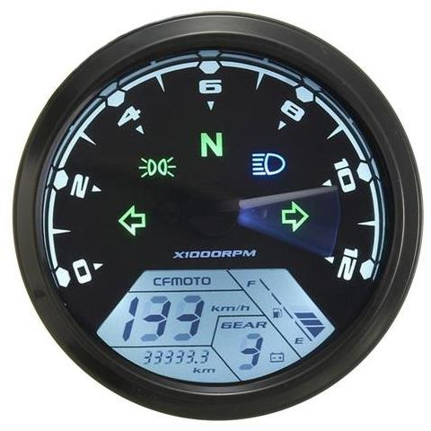
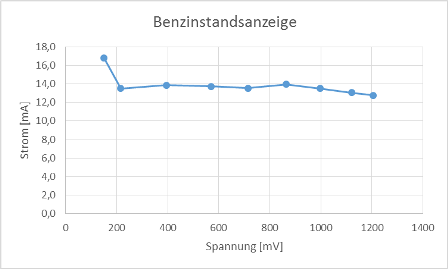
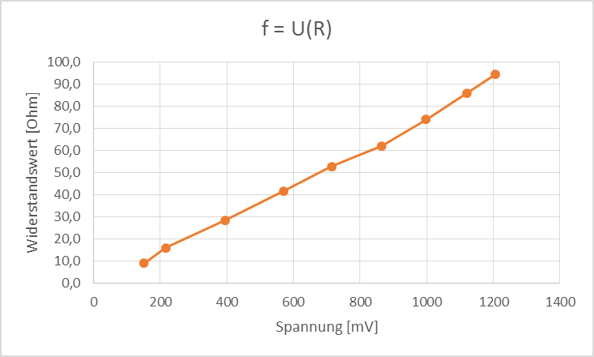

Bei eBay werden diverse __Universal LCD Motorrad Tachometer__ mit Drehzahlmesser und Kilometerzähler angeboten.

Dass die Tachometer häufiger nicht direkt funktionieren bzw. man sich die wichtigen Infos selber besorgen muss, ist leider bei den China Sachen häufiger der Fall. Den Kommentaren nach, haben Einige den Tachometer zum Laufen bekommen.

## Instrumentenseite
### 20pol Buchse Molex 5557

## Belegungsplan Kabelbaumseite
### 9pin Buchse DJ7091A-2.8-21

1. hellblau - Blinker rechts, (+) geschaltet
2. blau - Fernlichtkontrolle, (+) geschaltet
3. braun/weiß - Lichtkontrollanzeige, (+) geschaltet
4. orange - Blinker links, (+) geschaltet
5. gelb/schwarz - Drehzahlmesser
6. grün - Masse (-)
7. blau/weiß - Tankanzeige
8. rot - Dauerplus (+) von Batterie
9. schwarz - Plus (+) geschaltet vom Zündschloss

### 3pin Buchse DJ7031A-2.8-21

1. rot/weiß - Positiver Anschluss (+) für Wegstreckensensor
2. grün - Masse Anschluss (-) für Wegstreckensensor
3. schwarz/weiß - Impulsgeber (Hallsensor) für Wegstrecke

### 6pin Buchse DJ7061A-2.8-21

1. grün/rot - Leerlaufkontrollanzeige (Neutral), gegen Masse zu schalten
2. rosa - Ganganzeige 1. Gang, gegen Masse zu schalten
3. blau/rot - Ganganzeige 2. Gang, gegen Masse zu schalten
4. grün/schwarz - Ganganzeige 3. Gang, gegen Masse zu schalten
5. gelb/rot - Ganganzeige 4. Gang, gegen Masse zu schalten
6. gelb/weiß - Ganganzeige 5. Gang, gegen Masse zu schalten

### 2pin Buchse DJ7021A-2.8-21

1. n/a - nicht belegt
2. grün/weiß - Ganganzeige 6. Gang, gegen Masse zu schalten

An die Tankanzeige kann auf einen Sensor für 100 Ohm oder 500 Ohm angeschlossen werden. Im Instrument ist per Programmierung der Messsensor für 100 Ohm voreingestellt. Laut Datenblatt erfolgt der Bereich für die 100 Ohm Anzeige zwischen 98 Ohm (Leer) und 8 Ohm (Voll). Das Instrument erwartet eine Anschaltung gegen Masse. Eine Abschaltung der Tankanzeige ist nicht vorgesehen.

Messungen haben ergeben, dass ein offener Anschluss und alle Werte größer 90 Ohm zu einem Blinken der Anzeige führen. Auch wenn keine Tankanzeige benötigt wird, muss der Anschluss für die Tankanzeige passend beschaltet werden, da sonst eine blinkende Tankanzeige am Instrument stört. 

Das Kombiinstrument nutzt zur Messung des Widerstands eine Konstantstromquelle, welche einen konstanten elektrischen Strom von ca. 13mA in den Stromkreis einspeist. Für die Aussteuerung der Balkenanzeige nutzt das Instrument die elektrischen Spannung an ihren Anschlusspunkten.

Es wurde folgende Messreihe aufgenommen:

Balken | Spannung  | Strom  | Widerstandswert
--- | --- | --- | ---
8 | 151 mV | 16,8 mA | 9 Ohm
7 | 216 mV | 13,5 mA | 16 Ohm
6 | 395 mV | 13,9 mA | 28,5 Ohm
5 | 571 mV | 13,7 mA | 41,6 Ohm
4 | 714 mV | 13,5 mA | 52,7 Ohm
3 | 865 mV | 14 mA | 62 Ohm
2 | 998 mV | 13,5 mA | 73,9 Ohm
1 | 1121 mV | 13,1 mA | 85,9 Ohm
Anzeige blinkt | 1205 mV | 12,8 mA | 94,3 Ohm

Die Leerlaufspannung der Konstantstromquelle beträgt ca. 5 Volt.

Lichtkontrollanzeige soll später als Motorkontrollanzeige genutzt werden. Die Lichtkontrollanzeige wird gegen Plus geschaltet, um sie zur Anzeige zur bringen. Messungen an der Lichtkontrollanzeige zeigen, dass die Lampe bereits bei einer Anschaltung von 3,5V zu glimmen beginnt. Hierzu muss das Instrument nicht eingeschaltet sein. Ab ca. 5V leuchtet die Kontrollleuchte gut sichtbar.

Es wurde folgende Messreihe aufgenommen:

Nr. | Spannung | Strom (Bemerkung)
--- | --- | ---
1 | 3,5 V | 0,4 mA (Kontrollleuchte glimmt)
2 | 4,9 V | 1 mA
3 | 10 V | 3,4 mA (unterer Arbeitsbereich vom Instrument laut Datenblatt)
4 | 11,9 V | 4,36 mA (unterer Schaltpunkt für Batterieanzeige im Instrument)
5 | 12 V | 4,4 mA
6 | 13,8 V | 5,27 mA (Ladeschlussspannung für 12V Blei-Batterie)
7 | 15 V | 5,85 mA (oberer Schaltpunkt für Batterieanzeige und oberer Arbeitsbereich)

Der Innenwiderstand RI der Kontrollanzeige beträgt bei 12V ca. 2,7kOhm

Bei der durchgeführten Messung wurde auch der Arbeitsbereich für Batterieanzeige im Instrument ermittelt: 11,9V bis 15V. Die Werte stimmen durchaus mit der Praxis. Eine fast entladene Batterie hat eine Spannung von 11,89V. Das Gasen einer 12V Blei-Batterie beginnt bei 14,4V.

Das Signal für den Drehzahlmesser kommt von Klemme 1 der Zündspule über einen speziellen Zündsignalwandler. Das Kombiinstrument hat einige Überraschungen und im Netz finden sich einige Hinweise auf missglückte Integrationen. Hauptkritikpunkt am Kombiinstrument ist, dass entgegen der Verkäuferaussagen eine einfache Anschaltung an eine Einzylinder-4-Takt-Maschine nicht möglich ist und somit für die Guzzi eine aufwändige Anpassung für die korrekte Darstellung der Drehzahl erfolgen muss, da jeder Zylinder eine eigene Zündspule hat.

## Quellen und weiterführende Literatur

### Links
- Cafe Racer Forum; [Kennt ihr dieses Instrument aus ebay...?](http://www.caferacer-forum.de/viewtopic.php?f=43&t=15340&p=234461)
- Banggood.com; [12000RMP LCD Digital Speedometer Odometer Motorcycle 1-4 Cylinders](http://www.banggood.com/en/12000-RMP-LCD-Digital-Speedometer-Odometer-Motorcycle-1-4-Cylinders-p-972677.html)

### Nächste Seite
Weiter geht's mit [Lade- und Öldruckkontrollanzeige](pages/kontrollanzeige_1.html).
