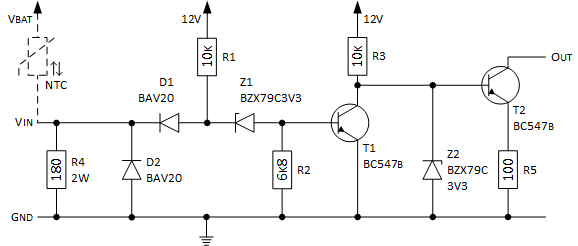

Die Guzzi besitzt keinen Geber und keine Reservelampe. Ein offener Anschluss und Werte größer 90 bzw. 500 Ohm bringen die Füllstandsanzeige des Kombiinstrumentes zum Blinken. Der Anschluss für die Tankanzeige muss daher passend beschaltet werden, da sonst eine blinkende Tankanzeige am Instrument stört. Die einfachste Methode ist es, dass Instrument auf einen Sensor von 500 Ohm umzuprogrammieren und mittels 470 Ohm Widerstand den Anschluss für die Tankanzeige gegen Masse zu schalten. Es wird dann nur der untere Balken angezeigt.

Die Ducati Monster verwendet ein [Heißleiter](https://de.wikipedia.org/wiki/Hei%C3%9Fleiter) (abk. NTC) als Benzinstandgeber. Der Sensor wird bei ausreichend gefüllten Tank vom Benzin umflossen und ist dadurch kalt. Der innenliegende Heißleiter leitet somit schlecht und verhindert so das Einschalten der zugehörigen Kontrolllampe im Original-Instrument. Sofern der Sensor nicht ausreichend von Benzin umgeben ist, erwärmt sich der Heißleiter (langsam) durch den Stromfluss und verliert (almählich) seinen hohen Anfangswiderstand.

Aufgrund der [Kaltleitereigenschaft einer Glühlampe](http://de.wikipedia.org/wiki/Kaltleiter#Metalle) kommt es zu einem zügigen Umschalten, sofern die Glühwendel auf Betriebstemperatur aufgeheizt ist. Mit steigender Temperatur erhöht sich der elektrische Widerstand und somit der Spannungsabfall an der Glühlampe, womit die Glühlampe die volle elektrische Leistung erhält. 

Die Bauteile unterliegen zwar einer Exemplarstreuung, doch durch die venwendete kombination aus Heißleiter-Sensor und Glühlampen-Kaltleiter kann eine sehr steile Kennlinie für einen bestimmten Temperaturbereich erzielt werden. 

Es wurden folgende Messwerte (bei einer Batteriespannung von 12,6V) aufgenommen:

Tank | Strom | Spannung am Geber | Spannung a.d. Glühlampe
---- | ----- | ----------------- | --------------------------
voll | 10mA  | 12,4V             | 0,2V
leer | 78mA  | 2,2V              | 10,4V (Kontrollleuchte an)

## Tanklevelanzeige
Die Tanklevelanzeige vom Kombiinstrument arbeitet auf Widerstandbasis. Zur Bestimmung des Widerstanswerte misst das Instrument die Spannung bei einem vorgegebenen konstanten Strom.

Wie bereits weiter oben beschrieben verhält sich der Benzinstandsgeber der Ducati nicht wie ein _Widerstandsgeber_, sondern eher wie ein _Schalter_. Die folgende Schaltung kann daher nur die beiden Zuständen **leer** (Balkenanzeige blinkt, entspricht Widerstand unendlich) oder **voll** (volle Balkenanzeige, Widerstand 100 Ohm) anzeigen. 

Die Benzinstandsanzeige wird mit Hilfe eines zweistufig invertierenden Schaltverstärker realisiert. Das Eingangssignal wird mittels eines [Spannungsteilers](https://de.wikipedia.org/wiki/Spannungsteiler) bestehend aus NTC und Widerstand R4 an den Diodeneingang der invertierenden Schaltstufe ([DTL-Logik](http://de.wikipedia.org/wiki/Diode-Transistor-Logik)) angelegt. D2 dient dem Schutz bei negativen Spannungen und Z1 dem anheben des High-Pegels. Der Widerstandswert R4 errechnet sich aus den gemessenen Wert bei leerem Tank (siehe oben):

    R4 = U(R4) / I(R4)
       = 10,4V / 0,078A
       = 133 Ohm

Um die abzuführende Leistung gering zu halten, wird ein Wert von 180 Ohm genutzt. Die maximale Leistung bei direktem Anschluß an Ubat = 15V beträgt 1,25 Watt.  

Die Umschaltspannung Uu von 5,1V wird durch Nutzung der Z-Diode Z1 festgelegt (Z-Dioden mit Werten < 5V sind bei kleinen Störmen schlecht geeignet, daher wurde hier eine Z-Diode mit einem Wert von 5,1V gewählt). In Abhängigkeit von der Eingangsspannung wird folgendes Verhalten erzielt: 
- Sobald am Eingang die Spannung von ca. 5V unterschritten wird (Uin < Uu), sperrt der Transistor und am Ausgang liegt der 100 Ohm Widerstand über den Transistor der zweiten Stufe gegen Masse.
- Sofern die ca. 5V überschritten werden (Uin > Uu) leitet der Transistor der ersten Stufe und der Transitor der zweiten Stufe sperrt. Der Ausgang ist somit unbeschaltet.

Mit einem Eingangswiderstandswert von 10k und einem Widerstand von 6,8k gegen Masse fließt mit Ubat = 10V bis 15V und bei Uin > Uu ein ausreichend großer Basisstrom über R1 zum Transistor der ersten Schaltstufe, um die direkt angekoppelte Schaltstufe ([DCTL](http://en.wikipedia.org/wiki/Direct-coupled_transistor_logic)) bestehend aus R3 und T2 sicher zu schalten. Die Z-Diode Z2 zwischen Basis und Emitter von T2 dient als Strombegrenzung (ca. 26mA) bei Anwendung eines 100 Ohm Widerstandes für die Füllstandsanzeige. Die maximale Leitung für T2 bei direktem Anschluss des _Out_ Ausganges an Ubat = 15V beträgt :

    P(T2) = (Ubat_max - Uz + Ube) * I_max
          = (15V - 3,3V + 0,7V) * 26mA
          = 286 mW

## Quellen und weiterführende Literatur

### Links
- Duc-Forum.de; [Tankkontrollleuchte LED für alte SS/Monster funzt](http://www.duc-forum.de/thread.php?threadid=71131)
- Wikipedia; [Elektrische Eigenschaften einer Glühlampe](https://de.wikipedia.org/wiki/Gl%C3%BChlampe#Elektrische_Eigenschaften)

### Nächste Seite
Weiter geht's mit [Zündsignalwandler](zuendsignalwandler_1.html).
