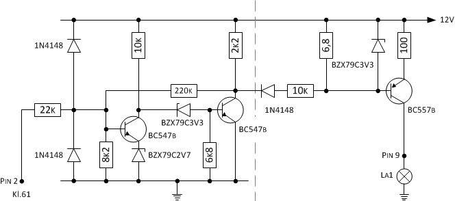
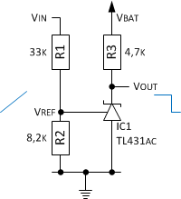
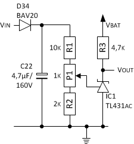
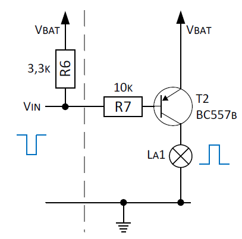
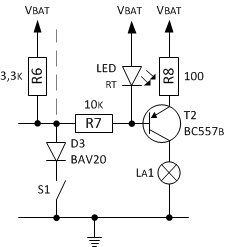
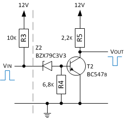

Die Guzzi hat eine Ladekontrollleuchte die im Original zwischen Anschluss Kl.61 vom Gleichrichter und der positiven Versorgungsspannung (12V) vom Instrument liegt. Es kann zwar nicht der Ladezustand oder die aktuelle Spannung geprüft werden, aber es gibt zumindest eine Anzeige, dass die Batterie bei laufenden Motor geladen wird.

Da sowohl der Regler und Gleichrichter sowie das Instrument ausgetauscht werden, ist eine Anpassung der Funktion Ladekontrollleuchte notwendig. Das China-Instrument bietet leider keine eigene Ladekontrollleute. Da die Tachobeleuchtung als Kontrolle ob Licht eingeschaltet ist ausreicht, wird zukünftig die Lichtkontrollleuchte als Anzeige genommen.

Die Kontrollleuchte soll immer zur Anzeige kommen, wenn mehr Strom der Batterie entnommen wird als hinein fließt. Hierzu wird der Schaltpunkt für die Anzeige einfach über die Ladeschlussspannung definiert. Bei einer 12V Blei-Batterie beträgt die Ladeschlussspannung bei Schonladung 13,8V. Der Generatorspannung muss aber mindestens 13,4V liefern, damit mindestens eine Erhaltungsladung stattfindet. Eine vollgeladene Batterie sollte 12,8 V haben, bei ca. 12,4V ist Sie Normal geladen, bei ca. 12,2V Schwach geladen, bei ca. 11,9 V Normal entladen und bei Werten unterhalb von 10,7 V Tief entladen.

Die Guzzi bieten darüber hinaus eine Öldruckanzeige. Der zugehörige Sensor wird bei Problemen gegen Masse geschaltet und bringt im Original im Instrumente eine Lampe zur Anzeige, die an die Versorgungsspannung angeschlossen ist.

Die folgende Beispielschaltung soll an einem Fahrzeug mit 12V-Netz eine Kontrollleuchte im Instrument ansteuern. Die Kontrollleuchte La1 wird ab einer Spannung von unter 13,8V an Kl.61 eingeschaltet. Zudem schaltet der Schalter S1 (geschaltet gegen Masse) ebenfalls die Kontrollleuchte.

## Messen der Spannung an Kl.61
Im Internet gibt es hierzu Beispielkonfiguration auf Basis eines TL431AC. Der TL431 ist laut Datenblatt (www.ti.com/lit/ds/symlink/tl431.pdf) eine "Programmable Voltage Reference", arbeitet im Prinzip als einstellbare Z-Diode. Der Baustein ist klein genug um kommt im TO92 Gehäuse daher. Mit einem
Spannungsteiler an Vref lässt sich stufenlos eine Spannung zwischen circa 2,5V und 36V einstellen. Da intern ein Operationsverstärker genutzt wird, schaltet der TL431 mit hoher Genauigkeit.

Der Spannungsteiler aus R1 und R2 lässt sich mit folgender Formel bestimmen.

    V0 = (1+(R1/R2))*Vref

Durch die eng tolerierte Referenzspannung VREF von typischerweise 2,495V (siehe Datenblatt) und den schwachen Eingangsstrom an Vref (Iref) von 2 bis 4 μA (siehe Datenblatt) lässt sich der Spannungsteiler ziemlich genau berechnen. Mit den Normwerten 6,8k und 1,5k schaltet der TL431 bei V0 = 13,8V zwischen Katode und Anode durch.

Zum Schutz vor negativen Spannungsspitzen (bis zu -100V) wird zusätzlich eine Diode vom Typ BAV20 eingesetzt. Ein Kondensator (4,7μF / 160V) puffert bei kurzen Spannungseinbrüchen. An der Diode fällt in Durchlassrichtung eine Spannung von Uf = 1V ab (V0 ist somit 12,8V). Für eine Feinanpassung wird ein Potenziometer mit 1k eingesetzt. Mit den Normwerten von 10k und 2k und unter Berücksichtigung von Uf inkl. Toleranzen (E24-Normreihe mit 5% Toleranz) können mit dem Potentiometer P1 in jedem Fall Spannungsschaltwerte zwischen 12,6V und 14,8V eingestellt werden.

Der TL431 soll bei allen Spannungen (Arbeitsbereich vom Instrument 10-15V) zuverlässig arbeitet. R4 muss so Dimensioniert sein, dass der Strom zwischen Katode und Anode Ika mindestens 1 mA und maximal 100 mA beträgt (siehe Datenblatt). Zu beachten ist, dass eine Anwendung des TL431 als Komparator die unpraktische Eigenschaft hat, dass die Spannung Vout im durchgeschalteten Zustand nicht unter Vka sinken kann.

    R3(max) = (Vmin-Vka)/Ika(min) = 10V-2,5V / 1mA = 7,5kOhm
    R3(min) = (Vmax-Vka)/Ika(max) = 15V-2,5V / 100mA = 125Ohm

Bei einer Versorgungsspannung von 10-15V und einem Widerstand R3 von ca. 4,7kOhm beträgt der Strom zwischen Katode und Anode ca. 1,6 bis 2,7mA.

## Schalten der Versorgungsspannung
Die Kontrollleuchte ist im Instrument gegen Masse geschaltet. Sie erfordert also das schalten Versorgungsspannung. Da dies weiterhin elektronisch passieren soll, nutzen wir hierzu ein PNP-Transistor. Hier liegt der Emitter an der Versorgungsspannung vom Fahrzeug (Kl. 30).

Zur Anwendung kommt ein Transistor Typ BC557B (Datenblatt: https://www.fairchildsemi.com/ds/BC/BC560.pdf) der die Kontrollleuchte La1 bei 12V mit einer gemessenen Last von 2,7kOhm schalten soll.

Die Steuerspannungen Vbe am Transistor bezieht sich bei einem PNP-Transistor auf die positive Versorgungsspannung und nicht auf Masse. Ein PNP immer schaltet dann durch, wenn Vbe die Schaltschwelle unterschreiten, also Vin um Vbe kleiner ist als die Spannung Ve am Emitter.

Der Basiswiderstand R7 berechnet sich aus (Vbat-Vbe) / Ib. Etwas versteckt bei den Daten und der Kennlinie zu Vce(sat) (der Kollektor-Emitter-Sättigungsspannung) findet man eine Referenzwert für die Sättigung von Ic = 20*Ib. D.h. gerechnet wird mit einer Stromverstärkung in Sättigung von 20. Da nur kleine Ströme fließen (Ic < 10 mA und somit Ib < 0,5 mA) wird Vce(sat) mit dem im Datenblatt angegeben Wert von 90mV angesetzt.

Die Versorgungsspannung vom Instrument beträgt 10V bis 15V. Etwa 0,7V fallen an der Basis-Emitter-Strecke ab (Vbe aus Kennlinie des Datenblatt für den BC557B geschätzt), also wird bei einer niedrigen Versorgungsspannung von 10V für eine vernünftige Durchschaltung ein passender Widerstand R7 benötigt.

    Ib(min) = Ic(min) / 20 = 3,4 mA / 20 = 0,17mA
    R7(max) = Vbat(min) – Vbe / Ib(min) = (10V – 0,7V) / 0,17mA = 31,8kOhm

Der höchst zulässige Kollektorstrom IC für den Transistortyp beträgt max. 100mA mit einem zugehörigen Basisstrom Ib von 5mA (siehe Datenblatt). In dem Sättigungsbereich fallen bei hohen Strömen an der Basis-Emitter-Strecke 0,9V ab. Bei Versorgungsspannung von 15V ist der hierzu zulässige Widerstand R8 ebenfalls zu berechnen.

    Ib(max) = Ic(max) / 20 = 5,85 mA / 20 = 0,3mA
    R7(min) = Vmax – Vbe / Ib(max) = (15V – 0,9V) / 5mA = 2,8kOhm

Für unseren Anwendungsfall verwenden wir für R7 ein Widerstand von 10kOhm der einen Basisstrom von ca. 0,9 bei 10V bis 1,4 mA bei 15V hervorruft.

Damit die Transistorstufe zuverlässig arbeitet, kommt zusätzlich der Widerstand R6 zu Anwendung. Er vermeidet, dass der Transistor bei Störeinstrahlungen teilweise leitet indem er den Basisanschluss auf die Versorgungsspannung vorspannt, so dass der Transistor sperrt. Erst mit Schalten von VIN gegen Masse wird die Spannung herabgesetzt, so dass der Transistor leitet. Der dabei fließende Querstrom IQ soll ca. 3- bis 10-mal höher als der Basisstrom IB sein. Dabei gilt, je grösser dieses der Querstrom ist, umso schärfer ist der Knick vom sperrenden zum leitenden bzw. gesättigten Transistor.

    R6(max) = (Vbat(min) - Vin(min)) / Iq(min) = 10V - 90mV / (Ib(min) * 3) = 9,9V / (0,9mA * 3) = 3,5k
    R6(min) = (Vbat(max) - Vin(min)) / Iq(max) = 15V - 90mV / (Ib(max) * 10) = 14,9V / (1,4mA * 10) = 1,1k

In unserem im Anwendungsfall verwenden wir für R6 ein Widerstand von 3,3kOhm.

Da die Anschaltung von La1 erfolgt extern. Damit der PNP-Transistor bei einer Fehlbeschaltung vom Kollektor nicht zerstört wird ein Schutzwiderstand eingebracht. Der Widerstand R8 soll bei einem _Kurzschluss_ von La1 den maximalen Kollektorstrom Ic(max) begrenzen. Dieser beträgt laut Datenblatt 100mA. Die zugehörige Kollektor-Emitter-Spannung Vce wird mit 90mV angesetzt. Der Mindestwiderstand R8 lässt sich folgt berechnen:

    R8(min) = (Vbat(max) - Vce(sat)) / Ic(max) = 15V – 90mV / 100mA = 141Ohm

R8 sollte nicht zu groß gewählt sein, um den Spannungsabfall an R8 klein zu halten. Für R8 wird ein Wert von 300 Ohm gewählt, der den Strom Ic(max) auf 47 mA begrenzt. Die zugehörige Verlustleistung für R8 bei _Kurzschluss_ beträgt:

    Pmax = (Vbat(max) - Vce(sat)) * Ic = (Vbat(max) - Vce(sat))^2 / R8 = (15V – 90mV)2 / 300 = 0,6W

Die Kontrollanzeige La1 soll bei Verlust des Öldrucks zur Anzeige kommen. Der Öldrucksensor S1 schaltet gegen Masse. Die Integration des Sensors erfolgt über einfach unter Nutzung einer Schutzdiode.

## Invertieren der Messstufe
Es soll mit _positiver_ Logik geschaltet werden, also fügen wir eine NPN-Schaltstufe hinzu, die den Eingang der PNP-Schaltstufe versorgt. Zur Anwendung kommt der passende NPN-Transistor Typ BC547B (Datenblatt: https://www.fairchildsemi.com/datasheets/BC/BC547.pdf).

Die Beschaltung von R4 und R5 zu R3 muss im passenden Verhältnis zu den anliegenden Pegeln ausgesucht werden. Die Ansteuerung Vin erfolgt in Abhängigkeit vom TL431 die _Messstufe_. Im Schaltzustand _High_ liegt die Versorgungsspannung Vbat über den Widerstand R3 an. Im _Low_-Zustand liegt ein Potenzial an Vin von konstanten 2,5V hat.

Der notwenige Basisstrom Ib(min) für das Durchschalten des Transistors lässt sich mit der oben genannten Formel Ic = 20*Ib errechnen. Vce(sat) wird hier (wie oben) mit 90mV angesetzt.

    Ic(max) = I(R6) + Iout = (Vbat(max) – Vce(sat)) / R6 + Iout(max) = (15V - 90mV) / 3.3k + 1,4mA = 6mA
    Ib(min) = Ic(max) / 20 = 6mA / 20 = 0,3mA

Der daraus resultierende maximale Widerstand für R3 und R4 lässt sich über folgende Formel berechnen.

    (R3+R4)max = (Vbat(max) – Vbe) / Ib(min) = (15V – 0,7V) / 0,3mA = 48k

Der Widerstandswert R3 beträgt 4,7kOhm (siehe Messstufe). Für R4 wählen wir den nächst passenden Widerstandswert von 39kOhm aus der E12 Reihe, der den oben genannten Maximalwert nicht übersteigt.

Der Widerstand R5 vermeidet, dass der Transistor bei starken Störeinstrahlungen teilweise leitet. Je größer der Widerstand R5, umso empfindlicher ist die Schaltung gegen Umwelteinflüsse. Je niedriger dieser Widerstand, desto mehr Strom verbraucht die Schaltung im durchgesteuerten Zustand. Allgemeinen hat sich ein Wert von 10k bis 100kOhm (oder evtl. sogar mehr) bewährt. In unserem im Anwendungsfall verwenden wir für R5 ein Widerstand von 10kOhm.

R5 hat zusammen mit R3 und R4 auch den Zweck die Schaltschwelle über den Transistor zu erhöht, was hier bedeutet, dass die Schaltschwelle an Vin Richtung Versorgungsspannung verschoben wird. Die zugehörige Schaltschwelle Ves lässt wie folgt errechnen:

    Ves = ((R3 + R4) / R5 + 1) * Vbe = ((4,7k + 33k) / 10k + 1) * 0,7V = 4,5V

Die Differenz zur Schaltschwelle der Messstufe (bei _Low_ definiert über Vka = 2,5V) liegt also bei ca. +2V.

## Quellen und weiterführende Literatur

### Links
- Pauls Werkstatt von Paul; [Ladekontrollleuchte mit TL431](http://pauls-werkstatt.blogspot.de/2015/06/ladekontrollleuchte-mit-tl431.html)
- Fingers elektrische Welt; [Kurze Frage -> schnelle Antwort: Ladekontrollleuchte, Seite 254] (http://www.fingers-welt.de/phpBB/viewtopic.php?f=14&t=30&hilit=PLC_1&start=6325)
- Netzmafia von Prof. Jürgen Plate; [Präzisions-Shunt-Regler TL431](http://www.netzmafia.de/skripten/hardware/TL431/index.html)
- KHD-Homepage von Karl-Heinz Domnick; [Transistor-Schaltungen](http://www.domnick-elektronik.de/elekts1.htm)
- DL6GL von Georg Latzel; [Schalten mit Transistoren](http://dl6gl.de/grundlagen/schalten-mit-transistoren)
- Elektronik-Kompendium; [Schalten und Steuern mit Transistoren I](http://www.elektronik-kompendium.de/public/schaerer/powsw1.htm)
- Elektronik-Kompendium; [Pullup-, Pulldown-Widerstand , Maßnahmen zur Entstörung bei langer Leitung, Openkollektor - Wired-OR - Latchup-Risiken](http://www.elektronik-kompendium.de/public/schaerer/pullr.htm)
- Elektronik-Kompendium; [Überspannungsschutz von empfindlichen Verstärkereingängen](http://www.elektronik-kompendium.de/public/schaerer/ovprot.htm)

### Nächste Seite
Weiter mit [Umsetzung in CMOS](pages/cmos.html).
