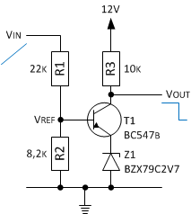

Die Guzzi sowie die Ducati Monster hat eine Ladekontrollleuchte, die im Original zwischen Anschluss Kl.61 vom Gleichrichter und der positiven Versorgungsspannung (12V) vom Instrument liegt. Es kann zwar nicht der Ladezustand oder die aktuelle Spannung geprüft werden, aber es gibt zumindest eine Anzeige, dass die Batterie bei laufenden Motor geladen wird.

Da sowohl der Regler und Gleichrichter sowie das Instrument ausgetauscht werden, ist eine Anpassung der Funktion Ladekontrollleuchte notwendig. Das China-Instrument bietet leider keine eigene Ladekontrollleute. Da die Tachobeleuchtung als Kontrolle ob Licht eingeschaltet ist ausreicht, wird zukünftig die Lichtkontrollleuchte als Anzeige genommen.

Die Kontrollleuchte soll immer zur Anzeige kommen, wenn mehr Strom der Batterie entnommen wird als hinein fließt. Hierzu wird der Schaltpunkt für die Anzeige einfach über die Ladeschlussspannung definiert. Bei einer 12V Blei-Batterie beträgt die Ladeschlussspannung bei Schonladung 13,8V. Der Generatorspannung muss aber mindestens 13,4V liefern, damit mindestens eine Erhaltungsladung stattfindet. Eine **vollgeladene** Batterie sollte 12,8 V haben, bei ca. 12,6V ist Sie **normal geladen**, bei ca. 12,4V **schwach geladen**, bei ca. 12,0 V **normal entladen** und bei Werten unterhalb von 11,8 V **tief entladen**.

Die Guzzi bzw. Ducati besitzt darüber hinaus eine Öldruckanzeige. Der zugehörige Sensor wird bei Problemen gegen Masse geschaltet und bringt im Original im Instrument eine Lampe zur Anzeige, die an die Versorgungsspannung angeschlossen ist.

Die folgende Beispielschaltung soll an einem Fahrzeug mit 12V-Netz eine Kontrollleuchte im Instrument ansteuern. Die Kontrollleuchte La1 wird bei einer Spannung von unter 12,6V (+/- 5%) an [Klemme 61](http://de.wikipedia.org/wiki/Klemmenbezeichnung#Beleuchtung) eingeschaltet. Zudem schaltet der Schalter S1 (geschaltet gegen Masse) ebenfalls die Kontrollleuchte.

## Messen der Spannung an Kl.61
Im Internet gibt es hierzu Beispielschaltungen auf Basis eines NPN Transistor mit Z-Diode als Regeler. Die Schaltung arbeitet im Prinzip als einstellbare Z-Diode. Mit einem Spannungsteiler an Uref lässt sich stufenlos eine Spannung größer Uref einstellen. Die Referenzspannung Uref beträgt bei Nutzung einer Z-Dode von 2,7V und Ube von 0,7V (bei Ib = 10mA und Ib = 0,5mA) einen Wert von 3,4V:

    Uref = Uz + Ube
         = 2,7V + 0,7V
         = 3,4V

Für einen Kollektorstrom von ca. 1mA wird nur ein schwacher Eingangsbasisstrom Ib (abhängig vom Gleispannungsverstärkung des Transistor siehe Datenblatt) von ca. 20 bis 40 μA benötigt, daher sollten R1 und R2 im Bereich kOhm liegen. Ein Spannungsverteilerverhältnis aus der E24-Normwerten 22k und 8,2k bringt den Transistor bei Uin = 12,5V zum schalten. Die Werte lassen sich mit folgender Formel bestimmen: 

    Uin = (1 + R1/R2) * Uref
        = (1 + 22k/8,2k) * 3,4V
        = 12,5V

Zum Schutz vor positiven und negativen Spannungsspitzen werden zusätzlich Dioden vom Typ 1N4148 am Punkt Uref eingesetzt.

Die Z-Diode soll bei allen Spannungen (Arbeitsbereich vom Instrument 10-15V) zuverlässig arbeitet. Um einen geringen Temperaturkoeffizient für eine Z-Diode von 2,7V zu erhalten (siehe Datenblatt) sollte R3 so dimensioniert sein, dass der Strom durch die Z-Diode ca. 1 mA beträgt. Zu beachten ist, dass die Regelschaltung mit Z-Diode die unpraktische Eigenschaft hat, dass die Spannung am Kollektor im durchgeschalteten Zustand nicht unter Uz sinken kann.

    R3(max) = (Umin-Ube-Uz)/Iz = 10V-0,2V-2,7V / 1mA = 7,1kOhm
    R3(min) = (Umax-Ube-Uz)/Iz = 15V-0,2V-2,7V / 1mA = 12,1kOhm

Bei einer Versorgungsspannung von 10-15V und einem Widerstand R3 von ca. 10kOhm beträgt der Kollektorstrom ca. 0,7mA (bei 10V) bis 1,2mA (bei 15V).

## Schalten der Versorgungsspannung
Die Kontrollleuchte ist im Instrument gegen Masse geschaltet. Sie erfordert also das schalten Versorgungsspannung. Da dies weiterhin elektronisch passieren soll, nutzen wir hierzu ein PNP-Transistor. Hier liegt der Emitter an der Versorgungsspannung vom Fahrzeug (Kl. 30).

Zur Anwendung kommt ein Transistor Typ BC557B (Datenblatt: [BC560.pdf](https://www.fairchildsemi.com/ds/BC/BC560.pdf)) der die Kontrollleuchte La1 bei 12V mit einer gemessenen Last von 2,7kOhm schalten soll. Vorteil des Transistors hier ist, dass der Spannungsabfall Uce(sat) am Transistor bei _Durchschaltung_ nur ca. 0,3V bis 0,65V beträgt. 

Die Steuerspannungen Ube am Transistor bezieht sich bei einem PNP-Transistor auf die positive Versorgungsspannung und nicht auf Masse. Ein PNP immer schaltet dann durch, wenn Vbe die Schaltschwelle unterschreiten, also Uin um Ube kleiner ist als die Spannung Ue am Emitter.

Der Basiswiderstand R7 berechnet sich aus (Ubat-Ube) / Ib. Im Datenblatt findet sich für den BC557 Typ **B** eine Gleichspannungsverstärkung von 200. Mit einem Überbuchungsfaktor ü = 3 erhält man die Stromverstärkung Ic/Ib von 200/3 = 66. Da nur kleine Ströme fließen (Ic < 10 mA und somit Ib < 0,5 mA) wird Uce(sat) mit dem im Datenblatt zugehörigen angegeben Wert von 0,3V angesetzt.

Die Versorgungsspannung vom Instrument beträgt 10V bis 15V. Etwa 0,7V fallen an der Basis-Emitter-Strecke Ube ab (bei Ic = 10mA), also wird bei einer niedrigen Versorgungsspannung von 10V für eine vernünftige Durchschaltung ein passender Widerstand R7 benötigt.

    Ib(min) = Ic(min) / 66
            = 10 mA / 66
            = 0,15mA

    R7(max) = Ubat(min) – Ube / Ib(min)
            = (10V – 0,7V) / 0,15mA
            = 62kOhm

Der höchst zulässige Kollektorstrom Ic für den Transistortyp beträgt max. 100mA mit einem zugehörigen Basisstrom Ib von 5mA (siehe Datenblatt). In dem Sättigungsbereich fallen bei hohen Strömen an der Basis-Emitter-Strecke 0,9V ab. Bei Versorgungsspannung von 15V ist der hierzu notwendige Basiswiderstand R7 ebenfalls zu berechnen.

    R7(min) = Umax – Ube / Ib(max)
            = (15V – 0,9V) / 5mA
            = 2,8kOhm

Für unseren Anwendungsfall verwenden wir für R7 ein Widerstand von 10kOhm der einen Basisstrom von ca. 0,9mA (bei 10V) bis 1,4mA (bei 15V) hervorruft.

Damit die Transistorstufe zuverlässig arbeitet, kommt zusätzlich der Widerstand R6 zu Anwendung. Er vermeidet, dass der Transistor bei offenenem Eingang durch Störeinstrahlung teilweise leitet, indem er den Basisanschluss auf die Versorgungsspannung vorspannt, so dass der Transistor sperrt. In unserem im Anwendungsfall verwenden wir für R6 ein Widerstand von 2,2kOhm.

### Strombegrenzung am Ausgang
Da die Anschaltung von La1 erfolgt extern und der PNP-Transistor bei einer Fehlbeschaltung vom Kollektor nicht zerstört wird, wird eine Strombegrenzung eingebracht.

Widerstand R8 und Z-Diode begrenzen den maximalen Kollektorstrom Ic(max) von La1 z.B bei _Kurzschluss_. Die Z-Diode bewirkt, dass an der Basis von T2 nur eine maximale Spannung von Uf = 3,3V erreicht werden kann. Die zugehörige Basis-Emitter-Spannung Vbe von T2 wird mit 0,7V angesetzt. Der maximale Strom wird erreicht, wenn der Spannungsabfall an R8 den Wert von 2,6V (Uf - Ube) erreicht. Der Widerstand R8, für einen vorgebenen maximalen Strom von 25mA, lässt sich wie folgt berechnen:

    R8(min) = (Uf - Ube) / Ic(max) = 3,3V – 0,7V / 25mA = 104 Ohm

Für R8 wird ein Wert von 100 Ohm gewählt, der den Strom Ic(max) auf ca. 26 mA begrenzt. Die maximale Verlustleistung für R8 unter _Last_ beträgt weniger als 1/2 Watt:

    Pmax = (Ubat(max) - Uce(sat)) * Ic
         = (15V – 0,3V) * 10mA
         = 382mW

Die Verlustleistung am Transistor beträgt bei _Kurzschluss_ ebenfalls nur ca. 0,3W. Die Berechnung erfolgt über die Kollektor-Emitter-Spannung Uce = Ubat(max) - U(R8) bei maximalen Strom Ic(max):

    Pmax = (Ubat(max) - U(R8)) * Ic
         = (15V – 2,6V) * 26A
         = 322mW

## Invertieren der Messstufe
Es soll mit _positiver_ Logik geschaltet werden, also fügen wir eine NPN-Schaltstufe hinzu, die den Eingang der PNP-Schaltstufe versorgt. Zur Anwendung kommt der passende NPN-Transistor Typ BC547B (Datenblatt: [BC547.pdf](https://www.fairchildsemi.com/datasheets/BC/BC547.pdf)).

Die Dimensionierung der Inverterstufe muss passend zu den anliegenden Pegeln erfolgen. Die Ansteuerung erfolgt in Abhängigkeit von der _Messstufe_. Im Schaltzustand _High_ liegt die Versorgungsspannung Ubat über den Widerstand R3 an. Im _Low_-Zustand hat das Potenzial Uz + Uce(sat):

    Uol = Uz + Uce(sat)
        = 2,7V + 0,3V
        = 3V

Der Widerstand R5 vermeidet, dass der Transistor bei Störeinstrahlungen teilweise leitet. Die Z-Diode hat den Zweck die Schaltschwelle über den Transistor zu erhöhen, was hier bedeutet, dass die Schaltschwelle für den Pegel _High_ verschoben wird. Die zugehörige Schaltschwelle Uih lässt wie folgt errechnen:

    Uih = Uz + Ube
        = 3,3V + 0,7V
        = 4V

Die Differenz zur Schaltschwelle der Messstufe beträgt somit ca. 1V.

## Einbringen einer Hysterese
Der _Messtufe_ wird bei minimalen Über- oder Unterschreiten der Referenzspannung bzw. der definierten Eingangsspannung hin und her kippen. Durch Einbringung definierter Schaltschwellen, die sich voneinander durch eine entsprechende Spannungsdifferenz unterscheiden, kann jedoch das Gesamtverhalten gegenüber Rauschen oder Störsignale verbessert werden.

Die Erzeugung dieser Schalthysterese kann mit Hilfe einer Mitkopplung erreicht werden. In unserem Fall indem ein Teil der Ausgangsspannung von der _Inverterstufe_ an den Eingang Ref der _Messtufe_ zurückgeführt wird. Dazu wird lediglich ein Widerstand (R9) benötigt.

Eine solche Schaltung wird als (nicht-invertierender) [Schmitt-Trigger](https://de.wikipedia.org/wiki/Schmitt-Trigger) bezeichnet. Berechnet wird die Hysterese durch Nutzung folgender Formeln (bei Uin = Ubat und unter Vernachlässigung von R6 weil R9 >> R6):

    U(low) = Uref * (R1||R9 + R2) / R2
           = (Uz + Ube) * (R1/R2 * R9/(R1+R9) + 1)
           = 3,4V * (22k/8,2k * 220k/(22k+220k) + 1)
           = 11,7V

    U(high) = Uref * (R1 + R2||R9) / (R2||R9)
            = (Uz + Ube) * (R1/R2 * (R2+R9)/R9 + 1)
            = 3,4V * (22k/8,2k * (8,2k+220k)/220k + 1)
            = 12,9V

## Quellen und weiterführende Literatur

### Links
- Elektroniktutor.de; [Regelverstärker zur Spannungsstabilisierung](https://elektroniktutor.de/analogtechnik/regelvst.html)
- Elektronik-Kompendium; [Schalten und Steuern mit Transistoren I](http://www.elektronik-kompendium.de/public/schaerer/powsw1.htm)
- DL6GL von Georg Latzel; [Schalten der Versorgungsspannung](http://dl6gl.de/grundlagen/schalten-mit-transistoren)
- Wikipedia; [Starterbatterie](http://de.wikipedia.org/wiki/Starterbatterie#Wartung,_Pflege_und_Prüfung)
- Wikipedia; [Konstantstromquelle](http://de.wikipedia.org/wiki/Konstantstromquelle#Mit_Bipolartransistor)
- Mikrocontroller.net; [Unterspannungsabschaltung gesucht](http://www.mikrocontroller.net/topic/340319#3744991)

### Nächste Seite
Weiter geht's mit [Öldruckkontrollanzeige](kontrollanzeige_2.html).
