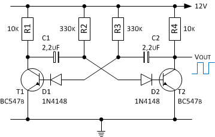
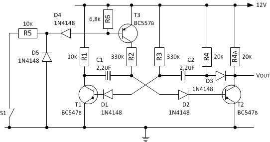
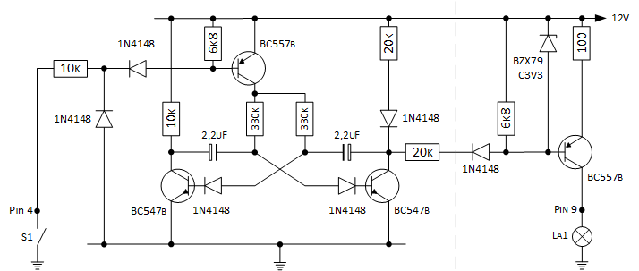

Die Kontrollanzeige _La1_ soll bei Verlust des Öldrucks ebenfalls zur Anzeige genutzt werden. Damit zwischen den beiden unterschiedlichen Ereignissen - _Störung Generator_ und _Öldruckverlust_ - unterschieden werden kann, soll bei Öldruckverlust die Kontrollanzeige mit ca. 1Hz blinken.

## Astabile Kippstufe
Die Schaltung besteht im wesentlichen aus einem astabilen Multivibrator bestehend aus T1 und T2, dessen Frequenz mit dem Widerstand R2 und R3 und den Kondensatoren C1 und C2 eingestellt wird. Da die zeitbestimmenden Werte Rt=R2=R3 und Ct=C1=C2 symetrisch sind, ist das Impuls-/Pausezeit gleich. Die Berechnung der Periodendauer und Frequenz erfolgt mittels folgender Formeln:

    T = ti + tp
      = ln2 * R2 * C1 + ln2 * R3 * C2
      = 2 * ln2 * Rt * Ct
      = 2 * 0,7 * Rt * Ct
      = 1,4 * 330k * 2,2uF
      = 508ms
      
    f = 1 / T
      = 1 / 1016ms
      = 1Hz
    

Die Dioden D1 und D2 dienen zum Schutz der Basis vom Transitor T1 und T2, da durch Umladung der Kondensatoren C1, C2 negative Spannungen in Höhe der Betriebsspannung auftreten können. 

Je größer die Werte von R1 und R4 sind, umso _verschliffener_ ist die positive Flanke des Impulses am Kollektor des betreffenden Transistors. Brauchbare Werte für R1 und R4 liegen etwa im Bereich von 470Ohm bis 10k. Auf der anderen Seite darf der Basiswiderstand R2, R3 nicht beliebig groß gewählt werden. Damit noch ein ausreichend größer Kollektorstrom Ic fließt, sollte bei minimaler Gleichstromverstärkung B ein Überbuchungsfaktor ü nicht kleiner 2 gewählt werden. Unter Verwendung von einem Überbuchungsfaktor ü = 3 und einem Kollektorwiderstand R1, R4 von 10k darf der maximale Widerstandswert für R3, R4 nicht größer 660k sein:

    Rb < B/ü * Rc
    Rt < 200/3 * R1,2
       < 66 * 10k
       < 660k

## Erweiterung Astabile Kippstufe
Die Flankensteilheit der positiven Flanke kann verbessert werden, indem man den Transistor mit einer Diode vom Kondensator entkoppelt. Die Flankensteilheit am Ausgang kann durch diese Maßnahme um den Faktor 10 verbessert werden. Damit der Kollektorstrom Ic (und der mindest Basisstrom Ib) bei Durchschalten von T2 ungefähr gleich bleibt, muss der Widerstandswert für R4 angepasst werden:

    R4 = R4a||R4a = 10k
    R4a = R4b = 20k

Der Öldrucksensor schaltet gegen Masse bei Öldruckverlust. Die Anschaltung und Aktivierung des Multivibrators erfolgt mittels geeigneter Transisor-Logik. Der PNP-Transistoren T3 dient zusammen mit Widerstand R5 als invertierende Schaltstufe, um den Multivibrator _freizugeben_. D4 dient zum Schutz vor Überspannung und D5 schützt den Transsitor T3 vor negativen Spannungen. Da die Basis vom Transistor T3 im Ruhezustand unbeschaltet ist, kommt R6 zum Einsatz.

## Gesamtschaltung Öldruckkontrollanzeige
Die gesamte Schaltung erhält noch die bereits verwendete Schaltstufe zur Anschaltung der Kontrollampe La1 (siehe [hier](kontrollanzeige_1.html)). Der Abgriff erfolgt nicht direkt sondern mit eigener Entkopplungsdiode an der Basis vom Transistor.

## Quellen und weiterführende Literatur

### Links
- Wikipedia; [Multivibrator](https://de.wikipedia.org/wiki/Multivibrator#Astabile_Kippstufe_mit_Transistoren)
- Siemens; Halbleiter-Schaltbeispiele Ausgabe April 1970; [5.2.3 Schaltverstärker mit Selbsthaltung](http://www.fingers-welt.de/info/siemens_schaltbeispiele_1970_1.pdf)
- Texas Instruments; Design and Application of Transistor Switching Circuits; [14 Pulse-generating and Pulse-shaping Networks](http://archive.org/details/DesignAndApplicationOfTransistorSwitchingCircuits/page/n285)

### Nächste Seite
Weiter geht's mit [Lade- und Öldruckkontrollanzeige mit CMOS](kontrollanzeige_3.html).
