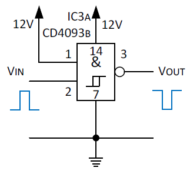
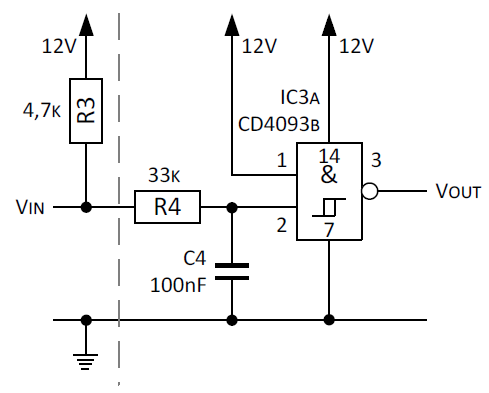
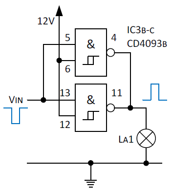
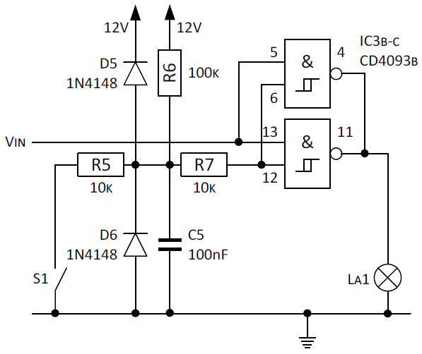

Ziel ist es sowohl die NPN-Schaltstufe hinzu als auch PNP-Schaltstufe durch ein IC zu ersetzen. Zur Anwendung kommt der Baustein CD4093B (Datenblatt: [cd4093bc.pdf](http://www.ti.com/lit/ds/symlink/cd4093bc.pdf)), welches vier NAND-Schmitt-Trigger mit je 2 Eingängen zum Einsatz. An den Betriebsspannungsanschlüssen sind bei der CMOS Familie 4000 eine Spannung für Vcc (= Betriebsspannung) von +3V bis +18V und für Vss (= Masse) 0V anzulegen.

Aufgabe der NPN-Schaltstufe war es das Signal zu invertieren. Die folgende einfacher Schaltung kann die Funktion mittels 4093 abbilden.

Die folgenden einfachen Methoden, sollen den CMOS-Eingang der Schaltstufe unempfindlich gegenüber Störsignalen machen.

Die beiden Widerstände R3 und R4 fungieren aus Sicht vom CMOS-Eingang zusammen als Pullup-Widerstand, der den Spannung-Pegel hinaufzieht bis zum Betriebsspannung. Betreffs der Größe vom Widerstand kommt es ganz auf die Anwendung an. In der Praxis eignen sich gut Werte von 10k bis einigen 100k. Hier beträgt der Wert 37,7k, summiert aus R3 mit 4,7k (geringer Wert, damit ein minimaler Strom IKA von > 1mA durch den TL431 fließt) und R4 mit 33k.

Der Einsatz des Kondensator C4 schafft Abhilfe gegen mittel- und niederfrequente Störungen bzw. schnellen Wechseln des TL431-ICs Schaltzustandes. Beim Wechsel vom leitenden Zustand (Low) in den sperrenden Zustand (High) wirkt die Zeitkonstante (R3+R4)*C4 mit ca. 3,8ms. Beim umgekehrten Wechsel von High nach Low erzeugt R4 mit C4 eine Zeitkonstante von 3,3ms. Bei diesen Werten können kleine Signaländerungen kaum stören und hochfrequente Störsignale haben ebenfalls keine Chance, da C4 ein Keramikkondensator ist.

Durch diese Maßnahme ist die Flankensteilheit beim Umschalten vom TL431 sehr niedrig. Dies kann, wenn der CMOS-Eingang keine Schmitt-Trigger-Funktion aufweist, während des Schaltvorganges zu kurzzeitigen unkontrollierten Schwingungen am Ausgang des NAND führen. Daher kommt ein NAND-Baustein
mit Schmitt-Trigger-Funktion zum Einsatz.

Bezogen auf den Arbeitsbereich von 10V bis 15V, ändert sich Aufgrund der Schmitt-Trigger-Funktion vom 4093, bei einer in positiver Richtung ansteigenden Eingangsspannung und einer Betriebsspannung von 10V der Ausgang bei 5,9V und bei einer Betriebsspannung von 15V mit 8,8V. Bei der abfallenden Flanke der Eingangsspannung ändert sich der Ausgang dagegen erst bei 3,9V (Betriebsspannung 10V) bzw. 5,8V (Betriebsspannung 15V). D.h. die Hysterese beträgt bei einer 10V-Betriebsspannung 2V und bei einer 15V-Betriebsspannung 3V.

Aufgabe der PNP-Schaltstufe war es, die Versorgungsspannung zu schalten. Zentrale Frage ist, ob der Ausgangsstrom des CMOS NAND-Gatters ausreicht um den Kontrollanzeige zum Leuchten zu bringen? Das Datenblatt verrät dass der maximale Ausgangstrom von der CMOS Familie 4000 bei einer Betriebsspannung von 10V typischerweise 2,6 mA und bei 15V typ. 6,8 mA. Sollte der Ausgang sogar gegen Masse oder die Betriebsspannung kurzgeschlossen sein, fließt der oben genannte Strom aus bzw. in den Ausgangspin und die Spannung bricht zusammen.

Wenn man mehrere Gatter parallel schaltet (Ein- und Ausgänge) steht jedoch ein größerer maximaler Ausgangstrom zur Verfügung. Auch wenn dies der _reinen Lehre_ widerspricht, die Praxis zeigt, dass es sehr viele Schaltungen gibt, bei denen Gatter parallelgeschaltet werden, um die Treiberleistung zu erhöhen. Die parallelgeschalteten Gatter müssen sich aber zwingend in einem gemeinsamen Schaltkreis befinden, um gleiche Anstiegs- und Abfall- und Durchlaufzeiten zu garantieren.

Die Kontrollanzeige La1 soll wie bisher bei Verlust des Öldrucks ebenfalls zur Anzeige kommen. Die Integration des Sensors erfolgt einfach an dem Eingang vom NAND. Was fehlt ist eine passende Beschaltung, um unempfindlich gegen Störspannung zu sein. Und obwohl die CMOS Familie 4000 eine Eingangsschutzschaltung besitzt, soll zusätzlich ein Überspannungsschutz eingebaut werden.

Der Widerstand R6 dient als Pullup-Widerstand. Wie oben, dient er bei hochohmigen Eingang zusammen mit C5 der Entstörung von mittel- und niederfrequente Einkopplungen Störungen., denn wir dürfen nicht vergessen, dass die Leitung vom Schalter S1 bis zur Schaltung eine gewisse Induktivität besitzt, sprich sie funktioniert wie eine Antenne. Bei offenen Kontakt wirkt die Zeitkonstante R6*C5 mit 10ms. Bei geschlossenem Schalterkontakt ist der Eingang zwar niederohmig,
aber um Problemen vorbeugen, wird ein Widerstand R5 mit einem Wert von 10k zwischen Schalter und Eingang geschaltet. R5 erzeugt mit C5 eine Zeitkonstante von 1ms. Dies reicht aus, damit auch bei geschlossenem Kontakt eine niedrige Impedanz vorliegt.

Die Eingänge der CMOS-4000-Familie enthalten bereits integrierte Widerstands-Dioden-Netzwerke, die jedoch möglichst nicht überstrapaziert werden sollen. Die zusätzlichen Schutzdioden D5 und D6 verhindern positive und negative Überspannungsimpulse. Wichtig ist, dass man relativ schnelle Dioden verwendet. Eine träge Gleichrichterdiode (z.B. 1N4003) passt nicht, daher kommt eine Kleinsignaldioden vom Typ 1N4148 zum Einsatz.

Die gesamte Schaltung für die Kontrollanzeige sieht wie folgt aus:

In der fertigen Schaltung wird zusätzlich noch ein Stützkondensator C6 von 100nF direkt am 4093 zwischen Speisespannung und Masse eingesetzt.

## Quellen und weiterführende Literatur

### Links
- Elektronik-Kompendium; [Pullup-, Pulldown-Widerstand , Maßnahmen zur Entstörung bei langer Leitung, Openkollektor - Wired-OR - Latchup-Risiken](http://www.elektronik-kompendium.de/public/schaerer/pullr.htm)
- Elektronik-Kompendium; [Überspannungsschutz von empfindlichen Verstärkereingängen](http://www.elektronik-kompendium.de/public/schaerer/ovprot.htm)
- [Das CMOS Kochbuch](https://www.amazon.de/Das-CMOS-Kochbuch-Don-Lancaster/dp/3883220027) von Don Lancaster; ISBN 3-88322-002-7

### Nächste Seite
Weiter geht's mit [Zündsignalwandler](zuendsignalwandler_1.html).
