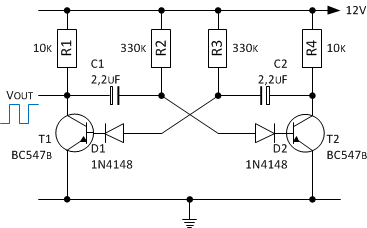
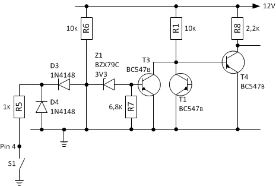

## Öldruckkontrollanzeige
Die Kontrollanzeige _La1_ soll bei Verlust des Öldrucks ebenfalls zur Anzeige genutzt werden. Damit zwischen den beiden unterschiedlichen Ereignissen - _Störung Generator_ und _Öldruckverlust_ - unterschieden werden kann, soll bei Öldruckverlust die Kontrollanzeige mit ca. 1Hz blinken.

Die Schaltung besteht im wesentlichen aus einem astabilen Multivibrator bestehend aus T1 und T2, dessen Frequenz mit dem Widerstand R2 und R3 und den Kondensatoren C1 und C2 eingestellt wird. Da die zeitbestimmenden Werte Rt=R2=R3 und Ct=C1=C2 symetrisch sind, ist das Impuls-/Pausezeit gleich. Die Berechnung der Periodendauer und Frequenz erfolgt mittels folgender Formeln:

    T = ti + tp
      = ln2 * R2 * C1 + ln2 * R3 * C2
      = 2 * ln2 * Rt * Ct
      = 2 * 0,7 * Rt * Ct
      = 1,4 * 330k * 2,2uF
      = 508ms
      
    f = 1 / T
      = 1 / 1016ms
      = 1Hz
    

Der Öldrucksensor schaltet gegen Masse bei Öldruckverlust. Die Anschaltung und Aktivierung des Multivibrators erfolgt mittels geeigneter Transisor-Logik. Die Transistoren T2 und T3 bilden zusammen mit dem gemeinsamen kollektorwiderstand eine NOR-Funktion und die Transistorstufe T4 dient als invertierende Schaltstufe, um die gewünschte Oder-Funktion zu erhalten. 

## Quellen und weiterführende Literatur

### Links
- Wikipedia; [Multivibrator](https://de.wikipedia.org/wiki/Multivibrator#Astabile_Kippstufe_mit_Transistoren)
- Play-Hookey; [4-Input RTL OR Gate](http://www.play-hookey.com/digital_experiments/rtl/rtl_or4.html)

### Nächste Seite
Weiter geht's mit [Lade- und Öldruckkontrollanzeige mit CMOS](kontrollanzeige_3.html).
