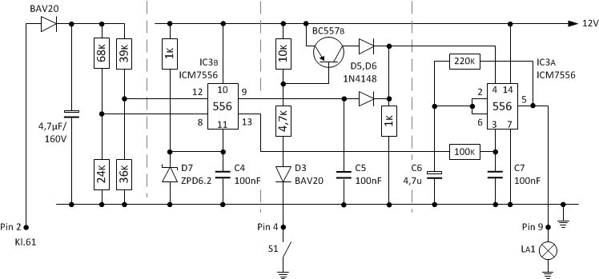

Die diskret aufgebaute Lade- und Öldruckkontrollanzeige kann auch mit einem einzelnen NE555 und einem halben Dutzend passiver Komponenten realsiert werden. Aufgabe der Diskreten Schaltung ist es, das Generatorsignal zu überwachen und bei Unterspannung die positiv Betriebsanschluss zu schaltend. Zusätzlich ist der Öldruckschalter mit eingebracht.

## Ladekontrollanzeige
Der allgegenwärtige NE555 _Timer_-Baustein ist ein sehr vielseitiger Chip. Es enthält zwei Spannungsvergleicher mit einer internen Referenz, eine RS-FlipFlop und ein _totem-pole_ Ausgangskreis, der je nach Ausführung bis zu 200 mA liefern bzw. aufnehmen kann. Alle diese Teile werden für die Ladekontrollanzeige verwendet.

Grundsätzlich funktionieren die drei für die Ladekontrollanzeige verwendeten Eingänge _Trigger_, _Treshold_ und _Control Voltage_ wie folgt:
- Wenn die Spannung am _Trigger_-Pin weniger als die Hälfte der Referenzspannung vom _Control Voltage_-Pin des IC's beträgt, wird das interne RS-FlipFlop gesetzt und der Ausgang _Output_ geht auf _High_ (fast bis Vcc).
- Wenn die Spannung am _Treshold_-Pin mehr als die Referenzspannung vom _Control Voltage_-Pin beträgt, wird das interne RS-FlipFlop zurückgesetzt und der Ausgang geht in den _Low_-Zustand (geerdet an die negative Versorgungsleitung).

Mit einer geeigneten Referenzspannung und zwei Spannungsteilern, kann die Funktion der Ladekontrollanzeige inkl. Hysterese erfüllt werden. 

Ein am Gleichrichter Klemme 61 bzw. D+ angeschlossener Spannungsteiler wird so ausgelegt und an Pin _Trigger_ angeschlossen, dass die Spannung an _Trigger_ gleich die Hälfte von der Referenzspannung von _Control Voltage_ ist. Dies ist der gewünschte Unterspannungsschaltpunkt. Wenn die Spannung an Klemme 61 unter diesen Sollwert sinkt, geht die Spannung am Ausgang _Output_ auf _High_.

Ein zweiter Spannungsteiler wird an _Treshold_ angeschlossen. Er ist so eingestellt, dass die Spannung an _Treshold_ gleich der Spannung von _Control Voltage_ist, wenn die Batteriespannung auf dem gewünschten Sollwert ist. Wenn die Spannung an Klemme 61 diesen Sollwert überschreitet, geht die Spannung an Pin  _Output_ auf _Low_.

Der Pin _Control Voltage_ benötigt eine stabile Spannung, um die korrekten Umschaltpunkte für die zwei interen Komparatoren, welche zusätzlich mit den Pins _Trigger_ und _Treshold_ verbunden sind, zu erhalten. Eine 6,2V Zenerdiode (0,5W) zusammen mit einem Vorwiderstand ist eine einfache und genügend genaue Spannungsreferenz. Der Vorwiderstand ist mit 1k so gewählt, dass die Zener-Spannung auch noch bei 10V Eingangsspannung oder darunter gehalten wird.

Die Widerstände R1, R2 und R3, R4 bilden die beiden Spannungsteiler. Betreffs der Größe vom Widerstand kommt es ganz auf die Anwendung an. In der Praxis eignen sich gut Werte von 10k bis einigen 100k. Der Wert von R1 beträgt 68k und der Wert von R2 beträgt 24k für den Umschaltpunkt der Unterspannung. Der Widerstand R3 ist mit 39k und R4 mit 33k festgelegt, um den Umschalztpunkt für die Sollspannung festzulegen.

Der Einsatz des Kondensator C5 schafft Abhilfe gegen Störungen beim Wechsel vom Zustand _High_ in den Zustand _Low_. Aufgabe der PNP-Schaltstufe war es, die Versorgungsspannung zu schalten. Der Ausgangsstrom des CMOS 556-Bausteins reicht ausreicht, um den Kontrollanzeige zum Leuchten zu bringen. Das Datenblatt verrät dass der maximale Ausgangstrom 100 mA betragen darf. Sollte der Ausgang sogar gegen Masse oder die Betriebsspannung kurzgeschlossen sein, fließt der eben genannte Strom aus bzw. in den Ausgangspin und die Spannung bricht zusammen.

## Öldruckkontrollanzeige
Die Kontrollanzeige La1 soll wie bisher bei Verlust des Öldrucks ebenfalls zur Anzeige kommen. Die Anschaltung des Sensors (Schalten der Masse bei Öldruckverlust) erfolgt einfach an den _Trigger_ Eingang vom _Timer_-Baustein. Was fehlt ist eine passende Beschaltung, um unempfindlich gegen Störspannung zu sein. Und obwohl der _Timer_-Baustein eine Eingangsschutzschaltung besitzt, soll zusätzlich ein _Überspannungsschutz_ eingebaut werden. 

Zur Anwendung kommt der CMOS Timer-Baustein TLC556 (Datenblatt: [tlc556m.pdf](http://www.ti.com/lit/gpn/tlc556m)), welcher zwei RC-Timer mit gemeinsamer Spannungsvorsorgung hat. An den Betriebsspannungsanschlüssen darf eine Spannung für Vcc (= Betriebsspannung) von +2V bis +18V und für Vss (= Masse) 0V angelegt werden.

## Lade-/Öldruckkontrollanzeige
Die gesamte Schaltung für die Kontrollanzeige sieht wie folgt aus:

In der fertigen Schaltung wird zusätzlich noch ein Stützkondensator C8 von 100nF direkt am TLC556 zwischen Speisespannung und Masse eingesetzt.

## Quellen und weiterführende Literatur

### Links
- Elektronik-Kompendium; [Timer NE555 und NE556](https://www.elektronik-kompendium.de/sites/bau/0206115.htm)
- Burton Lang; [NE555 Low Voltage Battery Disconnect Circuit](http://www.gorum.ca/lvdisc.html)
- [Das CMOS Kochbuch](https://www.amazon.de/Das-CMOS-Kochbuch-Don-Lancaster/dp/3883220027) von Don Lancaster; ISBN 3-88322-002-7

### Nächste Seite
Weiter geht's mit [Bezinstandsanzeige Ducati](benzinstandsanzeige.html).
