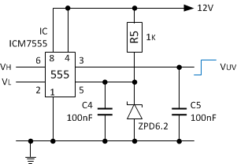
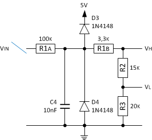
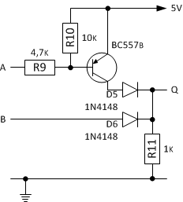
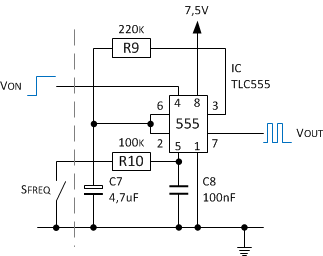
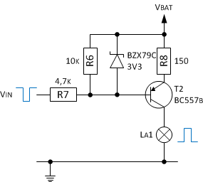

Die diskret aufgebaute Lade- und Öldruckkontrollanzeige kann auch mit einem einzelnen NE555 und einem Dutzend passiver Komponenten realsiert werden. Aufgabe der Diskreten Schaltung ist es, die Generatorspannung zu überwachen und bei Unterspannung die Ladekontrolllampe mit 12V zu versorgen. Zusätzlich wird bei schalten des Öldruckschalter gegen Masse die Kontrolllampe ebenfalls zur Anzeige gebracht. 

## Schaltung Ladekontrollanzeige
Der allgegenwärtige _Timer_-Baustein [NE555](http://de.wikipedia.org/wiki/NE555) ist ein sehr vielseitiger Chip. Es enthält zwei [Spannungsvergleicher](http://de.wikipedia.org/wiki/Komparator_(Analogtechnik)), die gegen eine interne oder über Pin 5 zugeführte Referenz vergleichen, ein [RS-FlipFlop](http://de.wikipedia.org/wiki/Flipflop#RS-Flipflop) und ein [Totem-Pole-Ausgang](http://de.wikipedia.org/wiki/Totem-Pole-Ausgang), der je nach IC-Ausführung bis zu 200 mA liefern bzw. aufnehmen kann. Alle diese Teile werden für die Realisierung einer Ladekontrollanzeige mittels NE555 (bzw. Äquivalent) verwendet.

Mit einer geeigneten [Referenzspannung](https://de.wikipedia.org/wiki/Referenzspannungsquelle) und geeignetem  [Spannungsteiler](http://de.wikipedia.org/wiki/Spannungsteiler), kann die Funktion der Ladekontrollanzeige inkl. [Hysterese](http://de.wikipedia.org/wiki/Schmitt-Trigger) erfüllt werden. 

Grundsätzlich funktionieren die drei für die Ladekontrollanzeige verwendeten Eingänge _Trigger_, _Treshold_ und _Control Voltage_ vom NE555 wie folgt:
- Wenn die Spannung am _Trigger_-Pin 2 weniger als die Hälfte der Referenzspannung vom _Control Voltage_-Pin 5 des IC's beträgt, wird das interne RS-FlipFlop gesetzt und der Ausgang _Output_-Pin 3 geht auf _High_ (Spannung erreicht fast Vcc: Kontolllampe leuchtet).
- Wenn die Spannung am _Treshold_-Pin 6 mehr als die Referenzspannung vom _Control Voltage_-Pin 5 beträgt, wird das interne RS-FlipFlop zurückgesetzt und der Ausgang Pin 3 geht in den _Low_-Zustand (Spannung erreicht fast 0V: Kontolllampe erlischt).

Der Pin _Control Voltage_ benötigt eine stabile Spannung, um die korrekten Umschaltpunkte für die zwei internen Komparatoren, welche zusätzlich mit den Pins _Trigger_ und _Treshold_ verbunden sind, zu erhalten. Eine mit Vorwiderstand angeschlossene Zenerdiode an Pin _Control Voltage_ könnte eine genügend genaue Spannungsreferenz liefern. Die integrierten Widerstände vom Timer sind jedoch genau genug, wenn eine stabile Versorgungsspannung genutzt wird. Die Referenzspannung am Pin _Control Voltage_ hat im unbeschalteten Zustand 2/3 von Vcc. Mit Vcc = 7,5 beträgt die Referenzspannung Vref = 5V.

Der Einsatz des Kondensator C5 schafft Abhilfe gegen Störungen beim Wechsel vom Zustand _High_ in den Zustand _Low_. Aufgabe der PNP-Schaltstufe war es, die Versorgungsspannung zu schalten. Der Ausgangsstrom des _Timer_-Bausteins reicht ausreicht, um den Kontrollanzeige zum Leuchten zu bringen. Das Datenblatt verrät, dass der maximale Ausgangstrom beim TLC555 bis zu 15 mA betragen darf. Sollte der Ausgang sogar gegen Masse oder die Betriebsspannung _kurzgeschlossen_ sein, fließt der eben genannte Strom aus den Ausgangspin und die Spannung bricht zusammen bzw. es dürfen bis zu 150mA in den Ausgangspin fließen. 

Ein am Gleichrichter Klemme 61 bzw. D+ angeschlossener Spannungsteiler bestehend aus R2 und R3 wird so ausgelegt und an Pin _Trigger_ angeschlossen, dass die Spannung an _Trigger_ gleich die Hälfte von der Referenzspannung von _Control Voltage_ ist. Dies ist der gewünschte Unterspannungsschaltpunkt. Wenn die Spannung an Klemme 61 unter diesen Sollwert sinkt, geht die Spannung am Ausgang _Output_ auf [High](http://de.wikipedia.org/wiki/Logikpegel).

Der Spannungsteiler bestehend aus R1 und R2+R3 wird so ausgelegt und an _Treshold_ angeschlossen, dass die Spannung an _Treshold_ gleich der Spannung von _Control Voltage_ ist, wenn die Batteriespannung auf dem gewünschten Sollwert ist. Wenn die Spannung an Klemme 61 diesen Sollwert überschreitet, geht die Spannung an Pin  _Output_ auf [Low](http://de.wikipedia.org/wiki/Logikpegel).

Der Widerstand R3 wird einfach festgelegt. Betreffs der Größe vom Widerstand R3 kommt es ganz auf die Anwendung an. In der Praxis eignen sich gut Werte von 10k bis 100k. Der Widerstand R3 wird mit 33k festgelegt. Die Untere Schaltschwelle soll bei ca. 11,9V und die obere bei ca. 13,4V liegen. Der Widerstand R2 wird Anhand der Hysterese (13,4V - 11,9V) nach folgender Formel berechnet:

    R2 = R3 * (2 * V0(low) / V0(high) - 1)
    R2 = 33k * (2 * 11,9V / 13,4V - 1)
    R2 = 25,6k

Der nächst passende Wert für R2 beträgt 27k. Der Widerstand R1 wird unter Verwendung der Referenzspannung (Vref = 5V) sowie R2 und R3 über die folgende Formel berechnet:

    R1 = R3 * (2 * V0(low) / Vref - 1) - R2
    R1 = 33k * (2 * 11,9V / 5V - 1) - 27k
    R1 = 97,1k

Für den Widerstand R1(+R6) wird ein Wert von 100k(+1k) genommen, dieser definiert mit den oben genannten Widerständen R2 und R3 die nun _tatsächlichen_ Umschaltpunkte 12,1V (_Low_) und 13,3V (_High_). Für die Bestimmung der realen Umschaltpunkte können folgende Formeln genutzt werden:

    V(low) = Vref * (R1 + R2 + R3) / (R2 + R3)
    V(low) = 5V * (100k + 27k + 33k) / (27k + 33k)
    V(low) = 12,1V

    V(high) = Vref / 2 * (R1 + R2 + R3) / R3
    V(high) = 5V / 2 * (100k + 27k + 33k) / 33k
    V(high) = 13,3V

## Erweiterung Öldruckkontrollanzeige
Die Kontrollanzeige _La1_ soll (wie bei der Diskret aufgebauten Schaltung auch) bei Verlust des Öldrucks ebenfalls zur Anzeige kommen. Die Anschaltung des Sensors (Schalten der Masse bei Öldruckverlust) erfolgt entweder einfach an dem _Trigger_ Eingang vom _Timer_-Baustein oder am Ausgang mittels geeigneter Logik bestehend aus Transisor und Dioden (abgek. [DTL](http://de.wikipedia.org/wiki/Diode-Transistor-Logik)).

## Gesamtschaltung Lade-/Öldruckkontrollanzeige
Zur Anwendung kommt der Timer-Baustein TLC556I (Datenblatt: [tlc556.pdf](http://www.ti.com/lit/gpn/tlc556)), welcher zwei RC-Timer mit gemeinsamer Spannungsvorsorgung hat und für einen Temperaturbereich von -40 bis 85°C vorgesehen ist. An den Betriebsspannungsanschlüssen darf eine Spannung für Vcc (= Betriebsspannung) bis +18V (empfohlen 2 bis 15V) und an den Eingängen _Treshold_, _Trigger_, _Control Voltage_ und _Reset_ eine maximale Spannung gleich der Betriebsspannung angelegt werden. 

Die Schaltug wurde durch eine nachgelagerte [Astabile Kippstufe](http://de.wikipedia.org/wiki/Multivibrator#Astabiler_Multivibrator_mit_NE555) ergänzt, damit die Anzeige nicht nur einfach leuchtet sondern blinkt.

Zudem wurde die Schaltung angepasst, sodass zwischen den beiden unterschiedlichen Ereignissen - _Störung Generator_ und _Öldruckverlust_ - unterschieden werden kann. Jedes Erreignis hat eine eigene Blinkfrequenz.

Die Beeinflussung der Frequenz erfolgt am Eingang _Control Voltage_ der Astabile Kippstufen, welche vom _Discharge_ Ausgang der Unterspannungschaltung angesteuert wird. Zusätzlich wurde die Anschaltung des Ödruckschalters nicht wie weiter oben an die Unterspannungschaltung sondern, mittels einer einfachen Logik an die nachgelagerten Kippstufe angeschaltet. 

Bleibt noch zu erwähnen, dass beim Ereignis _Öldruckverlust_ die Kontrolllampe schneller blinkt, als beim Ereignis _Störung Generator_ und dass das Ereignis _Störung Generator_ Vorrang hat. In der fertigen Schaltung wird zusätzlich noch ein Stützkondensator von 100nF direkt am Timer-IC zwischen Speisespannung und Masse eingesetzt.

Die gesamte Schaltung für die Kontrollanzeige erhält noch eine (bereits bekannte) _Schutzschaltung_ zur Anschaltung der Lampe La1 (siehe [hier](kontrollanzeige_1.html)). Der Abgriff erfolgt daher nicht am Ausgang _Output_ sondern am [Open Collector Ausgang](http://de.wikipedia.org/wiki/Open-Collector-Ausgang) _Dicharge_:

## Quellen und weiterführende Literatur

### Links
- Elektronik-Kompendium; [Pullup-, Pulldown-Widerstand , Massnahmen zur Entstoerung bei langer Leitung, Openkollektor - Wired-OR - Latchup-Risiken](http://www.elektronik-kompendium.de/public/schaerer/pullr.htm)
- Elektronik-Kompendium; [Ueœberspannungsschutz von empfindlichen Verstaerkereingaengen](http://www.elektronik-kompendium.de/public/schaerer/ovprot.htm)
- Elektronik-Kompendium; [Timer NE555 und NE556](https://www.elektronik-kompendium.de/sites/bau/0206115.htm)
- Burton Lang; [NE555 Low Voltage Battery Disconnect Circuit](http://www.gorum.ca/lvdisc.html)
- [Das CMOS Kochbuch](https://www.amazon.de/Das-CMOS-Kochbuch-Don-Lancaster/dp/3883220027) von Don Lancaster; ISBN 3-88322-002-7

### Nächste Seite
Weiter geht's mit [Bezinstandsanzeige Ducati](benzinstandsanzeige.html).
