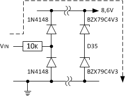

Im normalen Betrieb liegen die Spannungen im Kfz-Bordnetz bei 12V (10V bis 15V). Kritische Spannungspegel von bis 60V in Folge eines massiven Masseversatzes entstehen vor allem dann, wenn Masseverbindungen wegkorrodiert sind oder die Batteriepolklemmung locker ist. Dem nicht genug, die Versorgungsspannung fällt bis auf 8V beim Anlassen ab, hat ca. 12,6 V sobald das Kfz abgestellt ist, erreicht 14,4 V beim Fahren, 28,8 V beim Jumpstart vom LKW und kennt auch Spannungsspitzen von kurzzeitig -100 V wenn ein Relais abfällt oder +100 V, wenn ein Kabel der Lichtmaschine einen Wackelkontakt hat. Elektrische Kfz-Anlagen/Bauteile werden daher nach einer ISO-Norm (ISO 16750) getestet.

Als Verpolungsschutz sollte eine Diode (z.B. BAV21/250mA, 1N4003/1A, BYV27-200/2A) eingesetzt werden, die den Betriebsstrom und die maximalen Spannungsimpulse (von 100V oder mehr) aushält. Ein Elko 4,7..220μF (je nach Stromstärke) puffert kurze Spannungseinbrüche. Damit der Elko beim Absinken der Versorgungsspannung nicht entladen wird, sollte er in Reihe nach der Diode eingebracht werden. Eine zusätzliche Sicherung oder ein Drahtwiderstand mit hoher Leistung (u.a. auch wegen der Spannungsfestigkeit) begrenzt den Strom.

Für einfache Anwendungen reicht es, nur gegen zerstörerische Spannungen abzublocken:

Um Störungen mit hohen Frequenzen von der Schaltung fernzuhalten, ist ganz vorne am Eingang ein Keramikkondensator von 1..10nF zwischen Versorgungsspannung und Masse sinnvoll, der diese Frequenzen dämpft. Um es noch _sauberer_ zu haben, könnte man anstatt den Sicherungswiderstand eine Drossel mit 47μH setzen.

Um länger höhere Spannungen von der Schaltung fernzuhalten, wird eine Überspannungsschutzdiode (TVS-Diode, Transil) vom Typ P6KE30A (Unidirektional) eingesetzt, die erst bei einer Spannung von 28,5V (Spannung für den [Jumpstart](https://en.wikipedia.org/wiki/Jump_start_(vehicle)) ist 26V und der [Load Dump](http://de.wikipedia.org/wiki/Load_Dump) wird mit 27V angesetzt) leitet und bei vollem Ableitstrom nicht mehr als die maximal erlaubte Spannung der Bauteile an die Schaltung lässt (das Maximum liegt bei 41,5V mit einem Stromimpuls von 14,4A, siehe Datenblatt: [P6KE.pdf](http://www.st.com/resource/en/datasheet/p6ke.pdf)).

Eine Schaltung die zwar keine Prüfung nach ISO (7637-1 von 1990 für ein 12V-System) besteht, aber ein paar Faktoren bereits berücksichtigt, könnte wie folgt aussehen:

Die TVS-Diode P6KE30A hat eine Durchbruchspannung von 28,5V, leitet sicher bei 31,5V und begrenzt die maximale Spannung, wenn die Quelle mehr liefert. Nachfolgende Bauteile sollten bis zu ca. 35V vertragen (der dann abzuleitende Strom ist dann schon so hoch, dass der Sicherungswiderstand vorher _auslöst_). Bei Einsatz einer TVS-Diode kann der Keramikkondensator am Eingang ein 1nF/50V und der Elko ein Kondensator mit z.B. 100μF/50V sein. Da höhere Ströme durch die P6KE30A abfließen können, wurde die Diode BYV27-200 (Datenblatt: [BYV27-200.pdf](https://www.vishay.com/docs/86042/byv27.pdf)) ausgewählt, die für ein Strom If bis 2A genutzt werden kann. Zudem hat Sie eine Sperrspannung bis 200V und weist eine Durchlassspannung UF von maximal 1V auf.

Der Spannungsausgang an Pin 9 gibt nicht stabilisierte Spannung von ca. 12V aus. An Pin 7.1 steht eine stabile Spannung von ca. 5V bei wechselnden Laststrombedingungen zur Verfügung. Der maximal benötigte Ausgangsstrom an Pin 7.1 soll bis zu 20mA betragen. Eine Stabilisierung mittles Z-Diode (Datenblatt: [BZX79.pdf](http://www.nxp.com/documents/data_sheet/BZX79.pdf)) ist einfach und ausreichend für die angeschlossenen Schaltungseinheiten, die 5V benötigen. 

Indem ein Teil der Betriebsspannung am Widerstand R5 abfällt, werden Spannungen größer 5,1V heruntergeregelt. Die Leistungsaufnahme der Z-Diode kann gering gehalten werden. Am Vorwiderstand können jedoch bis zu 23V (siehe oben) abfallen, daher ist auch bei kleiner Strombelastung ein Widerstand mit einer Leistung von mind. 1 Watt nötig.

Da die Z-Diode beim _Versuch_ die Spannung zu stabilisieren, eine elektrische Welligkeit auf der Versorgung erzeugt, kommt ein zusätzlicher Entkopplungskondensator von 22μF/16V zum Einsatz, der kurze Lastspitzen abfängt und die Restwelligkeit der Ausgangsspannung reduziert.

Die Z-Diode ist zudem ein Teil der Schutzmaßnahme gegen Überspannung für alle Eingänge mit entsprechender Dioden-Schutzschaltung gegen Plus. Sobald an einem externen Eingang eine Überspannung erzeugt wird, die über eine Schutzdiodenschaltung nach Plus oder gegen Masse geleitet wird (siehe Abschnitt Kontrollanzeige), fließt ggf. ein genügend schädlicher Strom, der dazu führen kann, dass eines der Halbleiter Schaden nimmt. Die Z-Diode sorgt dafür, dass alle Spannungen von externen Eingängen die größer als die Betriebsspannung +0,7V sind (5,1V + 0,7V = 5,8V), sicher abgeleitet werden. Die Strombegrenzung erfolgt durch den Eingangswiderstand des jeweiligen externen Einganges.

## Quellen und weiterführende Literatur

### Links
- Mikrocontroller.net; [Kfz Spannungsspitzenkiller / Transientenschutz](http://www.mikrocontroller.net/articles/Kfz_Spannungsspitzenkiller_/_Transientenschutz)
- Mikrocontroller.net; [12V KFZ Versorgungs-Schaltung aus de.dse-faq](https://www.mikrocontroller.net/topic/392585)
- de.sci.electronics-FAQ; [F.23. Das KFZ-Bordnetz](http://www.dse-faq.elektronik-kompendium.de/dse-faq.htm#F.23)
- Elektronik-Kompendium; [PROTECTION STANDARDS APPLICABLE TO AUTOMOBILES](http://www.elektronik-kompendium.de/public/schaerer/FILES/sgs_pulsetest_auto.pdf)
- Elektronik-Kompendium; [Spannungsstabilisierung mit Z-Diode](http://www.elektronik-kompendium.de/sites/slt/1012151.htm)
- Das InterNetzteil- und Konverter-Handbuch von Dipl.-Ing Jörg Rehrmann; [3.1 Der Shunt-Regler](http://www.joretronik.de/Web_NT_Buch/Kap3/Kapitel3.html#3.1)

### Startseite
Zum Anfang geht's [hier](../index.html).
