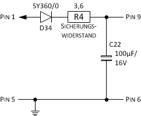
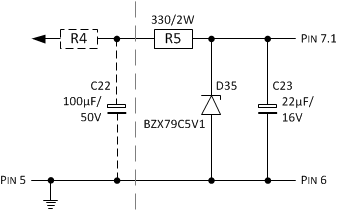
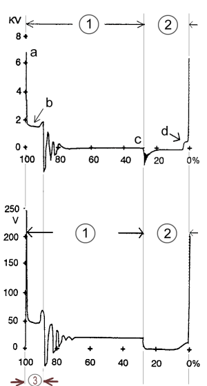
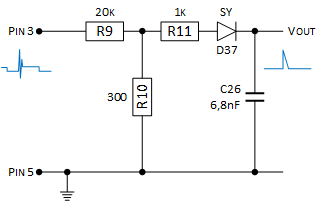
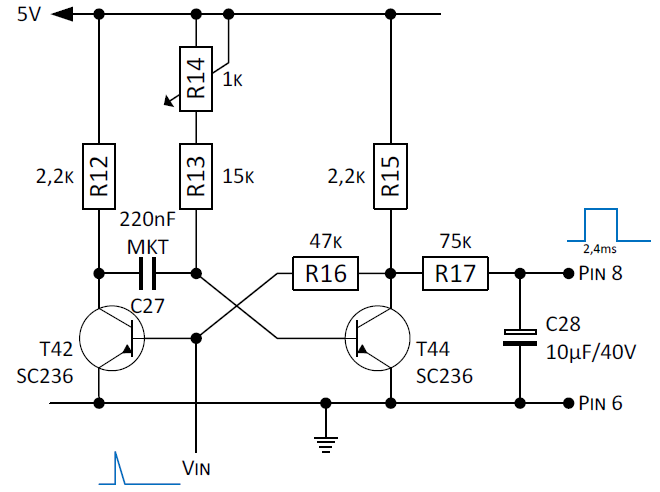
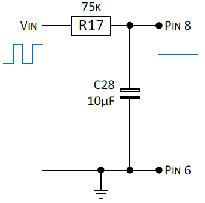
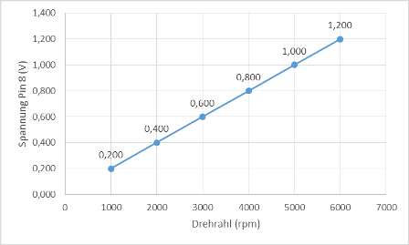

Als Ausgangsbasis für den Zündsignalwandler dient der Schaltplan von der __Geberplatine 16626__ eines LED Drehzahlmessers der __VEB Meßgerätewerk Beierfeld__.

Die Geberplatine hat folgende Funktionsteile:

- Absichern der 12V Versorgungsspannung vom Kfz-Bordnetz.
- Schaffung einer stabilisierten 5V Spannungsversorgung.
- Herabsetzen der Spannungsimpulse von der Zündspule.
- Aufbereitung der Zündimpulse.
- Impuls-/Spannungswandlung für die Nehmerplatine (LED-Drehzahlmesser).

## Absichern der 12V Versorgungsspannung
Die Schaltung bietet einfache Absicherungsmaßnahmen für die Versorgungsspannung vom Kfz, die an Pin 1 (zusammen mit Masse an Pin 5) anliegt. Als Verpolungsschutz ist eine Diode D34 eingesetzt. Der Widerstand R20 (2Watt) dient als Leitungsschutz. Der Kondensator C29 ist zur Absicherung der Versorgungsspannung gegen kurze Spannungseinbrüche. An Pin 9 wird die abgesicherte 12V Versorgungsspannung (und für Masse an Pin 6) herausgeführt.

## Erzeugung einer 5V Spannungsversorgung

Für den LED Drehzahlmesser und den Schaltungsteil zur Aufbereitung des Zündimpulses wird eine stabilisierte Spannung von 5V benötigt. Eine einfache Art der Spannungsstabilisierung, die bei Schaltungen bzw. Schaltungsteile mit geringer und weitestgehend konstanter Stromaufnahme eingesetzt wird, kann mit nur drei Bauteilen erreicht werden. Die Stabilisierungsschaltung besteht hierbei aus einer Spannungsteiler bestehend aus einem Widerstand R5 von 300 Ohm und einer Z-Diode D35 mit einer Zener-Spannung von 5,1V. Der Vorwiderstand R5 begrenzt den Strom und soll in der Hauptsache die Z-Diode vor der Zerstörung schützen. Die Z-Diode ist passend zur gewünschten Spannung (5,1V) und Verlustleistung (Pz < 200mW) ausgesucht. Der Widerstand R4 (2Watt) dient auch hier als Leitungsschutz. Der Kondensator C22 sichert Spannungseinbrüche am Eingang und C23 glättet die 5V Spannung. Die 5V Spannung wird an Pin 7.1 herausgeführt.

## Abgreifen der Zündimpulse an Kl.1
Das Signal für die Drehzahl soll an Klemme 1 von der Zündspulen abgegriffen werden. An Klemme 1 ist entweder Masse (Unterbrecher geschlossen) oder Zündungsplus (Unterbrecher offen), je nachdem, wie die Kurbelwelle gerade steht.

Als Alternative wird das Wickeln eines Drahtes um das Zündkabel vorgeschlagen, was leider kein gute Idee ist, denn spätestens wenn es regnet, kriechen ein paar kV über die Zündkabel, die überschlagen können. Die zweite Alternative, die Basisleitung des Zündtransistors (in unserem Fall von der Piranha-Schaltung) anzuzapfen, ist in der Praxis ebenfalls unüblich.

Leider ist das Signal an Klemme 1 nicht passend für eine digitale Verarbeitung. Das Signal kann mehrere Hundert Volt erreichen und hat starke (auch negative) Überschwinger („Klingeln“). Bei neuen Zündkerzen gibt es 150-200V Spitzen, bei schlechten auch mal 500V. Zudem sollte man sich zurückhalten relevante Ströme abzuleiten, da dies den Zündzeitpunkt verschieben kann. Das folgende Bild zeigt den typischen Signalverlauf an Sekundar- (obere Abb.) und Primärspule (untere Abb.):

Bezeichnungen und Deutung:

1. Öffnungsabschnitt: In diesem Abschnitt ist der Primärstrom abgeschaltet. Der Öffnungsabschnitt beginnt mit dem Zündzeitpunkt.
2. Schließabschnitt: In diesem Abschnitt ist der Primärstrom eingeschaltet. Der Primärstrom steigt an, bis die Primärstrombegrenzung ein weiteres Ansteigen verhindert. Im Diagramm kann der Schließwinkel in Prozent abgelesen werden. (Im Beispiel beträgt er knapp 30%)
3. Brennabschnitt: In diesem Abschnitt ist an der Zündkerze ein Funke vorhanden. Typische Werte der Brennspannungsdauer: 1,5 bis 2ms.

a. Zündspannungsnadel. Zum Zeitpunkt a wird der Primärstrom durch die Zündungsendstufe abgeschaltet. Der Zündfunke springt an der Zündkerze über (Zündzeitpunkt).
b. Brennspannungslinie. Ist der Funke gezündet, ist nur noch die Brennspannung notwendig, um den Funken aufrecht zu erhalten.
c. Einschalten des Primärstroms. Zum Zeitpunkt c schaltet die Zündungsendstufe den Primärstrom ein.
d. Begrenzung des Primärstroms durch die Primärstrombegrenzung

## Herabsetzen der Zündimpulse
Ziel ist es nur die positive Spitze (vom Brennabschnitt) der Primärspule als Trigger zu nutzen. Die negativen Spitzen werden durch eine Diode abgeblockt. Die Höhe der Spannung und das begrenzen des Stroms kann durch ein passendes Widerstandsnetzwerk erreicht werden.

Der Widerstand R11 ist ein Basiswiderstand für den Eingang an der Basis von Transistor T42. Vor der Basis von T42 ist zusätzlich eine Schutzdiode D37 geschalten, die auftretende negative Spannungen (der Transistor Typ SC236 hat eine Emitter-Basis-Sperrspannung UEB von max. 5V) an der Basis von T42 verhindert. An Pin 3 bzw. R9 liegen die Zündimpulse von der Zündspule vom Anschluss 1. Hierbei bildet R9 zusammen R10 einen Spannungsteiler um die Impulsspannung (von ca. 240V) der Zündspule herunterzusetzen. Damit T42 sicher durch steuert müssen diese Impulsspitzen entsprechend dem Verhältnis vom Spannungsteiler R9 zu R10 größer 80V sein (Spannungsabfall über R11 beträgt wenige mV, UF für D37 hat ca. 0,6V und UBE für T42 ca. 0,7V).

Zudem ist R10 ist so gewählt, dass der Strom Iq mindestens dreimal so hoch ist, wie der Basisstrom Ib der durch R11 fließt. C26 bildet zusammen mit R11 einen passiven Tiefpass 1.Ordnung um hochfrequente Spannung bzw. Nadelimpulse zu filtern. Die Grenzfrequenz f(g) liegt bei ca. 23kHz, sprich Impulse mit einer Impulszeit von unter 44μs werden _gefiltert_ bzw. steile Impulsflanken _geglättet_. Die Entladung von C26 über D37 ist nicht möglich, sondern erfolgt über Vout.

Die maximalen Spannungswerte an Pin 3 (positiv und negativ Spannung) werden durch die Auswahl der Bauteile R9 und D37 beeinflusst. Nur Widerstände mit hoher Leistungsangabe oder besonderer Bauart können auch hohe Spannungen aushalten. Bei R9 handelt es sich wahrscheinlich um ein 0,5W oder 1W Widerstand der bis 400V bzw. 500V Spannungsfest ist. D37 ist wahrscheinlich eine Standarddiode vom Typ SY160 oder SY162, die Spannungsspitzen von -50V bzw. -200V abblockt. Der maximal zulässige Basisstrom für T42 (SC236 mit Ib(max) = 10mA) wird erst ab Spannungen größer 650V (an Pin3) erreicht. Der maximale Spannungsabfall an C26 kann im Grenzbereich mit weniger als 10V angegeben werden.

## Aufbereitung der Zündimpulse
Für das _Klingeln_ gibt es jede Menge Lösungen mit Stichwort "Taster entprellen". Zur Aufbereitung der Impulse wird eine monostabile Kippstufe, aufgebaut mit Transistoren, zur Impulsregeneration verwendet.

Nur ein ausreichend großer positiver (> 80V) und andauender (> 44μs) Triggerimpuls von der Zündspule (Pin 3) schaltet den Transistor T42 in den leitenden Zustand. Sein Kollektorpotenzial fällt auf UCEsat von rund 0,2 Volt. Da im Umschaltmoment der Spannungswert über dem Kondensator C27 mit rund 5V gleich bleibt, erhält die Basis vom Transistor T44 diesen Wert als −5V (gegen Pin 6 ca. -4,8V wg. Uce = 0,2V). Das geänderte Potenzial sperrt T44 und an seinem Kollektor wechselt der Wert von Low (ca. 0,2V) auf High (hier 5V Betriebsspannung).

An Pin 8 von Ausgang R17 liegt nun die positive Betriebsspannung (hier 5V) an. Über den Basisvorwiderstand R16 (und R15) bleibt die Basis von T42 auch ohne Triggersignal positiv (UCE > 0,7V) und lässt den Transistor weiterhin leiten. Der Kondensator C27 wird während dieses Zustandes entladen. Die Entladung erfolgt über die Widerstände R13 sowie R14 und den durchgeschalteten Transistor T42. Da ein Transistor im durchgeschalteten Zustand einen sehr geringen Widerstand aufweist, ist nur R13 und R14 für die Entladezeit maßgeblich.

Nach Ablauf einer Zeit t ist der Kondensator C27 entladen und umgekehrt bis auf die Schwellspannung des Transistors T44 wieder aufgeladen. Erreicht das Potenzial UBE von T44 wieder 0,7V, so leitet dieser Transistor wieder. Sein Kollektorpotenzial fällt auf UCEsat also 0,2V und versetzt den Transistor T42 erneut in den anfänglichen Sperrzustand. Die Monostabile Kippstufe befindet sich wieder im Ausgangszustand und kann von einem neuen positiven Triggerimpuls gestartet werden.

Die Dauer, die der Kondensator nach dem Triggerimpuls zum entladen braucht, gilt als Verweilzeit. Die Entladung erfolgt über R13 und R14. Sie errechnet sich nach der Formel `t = ln2*R*C`:

    t1min = ln2 * R13 * C27 = 0,69 * 15k * 220nF = 2,23ms
    t1max = ln2 * (R13+R14) * C27 = 0,69 + (15k + 1k) * 220nF = 2,43ms

Mit dem Potentiometer R14 kann also die Impulsdauer des Ausgangssignals auf 2,35ms +/- 76μs verändert und somit das Übersetzungsverhältnis am Ausgang eingestellt werden.

Die monostabile Kippstufe benötigt auch eine Erholzeit. Um erneut kippen zu können muss der Kondensator wieder geladen werden. Der bestimmende Widerstand für diese Ladung ist R12. Die Erholzeit hat etwa den 3- bis 5-fachen Wert der Zeitkonstante, welche aus dem Produkt von R12 * C27 errechnet wird:

    t2 = 5 * R12 * C27 = 5 * 2,2k * 220nF = 2,42ms

Für R14 und C27 gibt es noch eine alternative Bestückung. R14 ist mit 22k und C27 mit 150nF angegeben. Die Zeiten für t1 liegen mit der alternativen Bestückung zwischen 1,58ms und 3,89ms und die Erholzeit t2 beträgt 1,65ms. Bei einem funktionierenden LED-Drehzahlmesser wurde R14 mit 8,1k gemessen, was einen t1-Wert von 2,43ms entspricht.

## Impuls-/Spannungswandlung
C28 soll laut Recherchen (im Wartburg-Forum) die Spannung für die Anzeige des Drehzahlmessers beruhigen, allerdings bewirkt C28, der einen Wert von 10 μF haben soll, zusammen mit R17 (75k) eine Umwandlung der erzeugten Impulse in eine analoge Spannung, die proportional zu Eingangsfrequenz ist. Die Angabe des Wertepaars mit 75k/10μF scheint für eine digitale Weiterverarbeitung daher nicht plausibel.

Ein kurzer Blick auf die Nehmer-Platine 52472 bestätigt dies, da dort ein A277D eingesetzt wird. Normalerweise werden Lauflichter digital realisiert, aber mit dem Einsatz des Schaltkreises A277 wird hier ein eigener Weg beschritten. Der A277 ist ein LED-Ansteuerschaltkreis aus DDR-Produktion und eine Weiterentwicklung vom Siemens-Schaltkreis UAA170 und UAA180. Mit diesem Schaltkreis ist es möglich 12 LEDs über eine veränderbare Spannung anzusteuern. Der A277 kennt zwei Betriebszustände und kann die LEDs im Punkt- oder im Bandbetrieb ansteuern. Im Punktbetrieb war der A277 kompatibel zum UAA170.

Unter der Annahme dass t1 ein Wert von 2,4ms erhalten soll und die Umwandlung der Impulse in eine Spannung über R12/C28 optimal erfolgt, ergibt sich für eine 1:1 Umsetzung (50 Impulse pro Sekunde entsprechen 3000 Umdrehungen pro Minute bei einem 2-Takt-Motor) folgende Darstellung:

Mit der oben genannten Erholzeit für t2 (von 2,4ms) können mit der Geber-Platine ca. 200 Impulse pro Sekunde sicher aufbereitet bzw. Drehzahlen können sicher bis ca. 12000 Umdrehungen (bei einer 1:1 Umsetzung) verarbeitet werden.

Für einen Abgleich auf dem Labortisch ist die Geberplatine mit einer Gleichspannung von etwa 12V (9 bis 15V) zu versorgen (+ an Pin 1 und – an Pin 5). Als Eingangssignal dient ein Klingeltrafo (8V~/50 Hz) der mittels Widerstand von 2k an Punkt R9, R10 und R11 und an Pin 5 (Masse) angelegt wird. Am Pin 8 sollte bei korrekter Einstellung genaue 0,6V angezeigt sein. Zum Feinabgleich dient der Trimmer R14.

## Quellen und weiterführende Literatur

### Links
- Mikrocontroller.net; [Zündimpuls vom Zündkabel](https://www.mikrocontroller.net/topic/81838)
- Mikrocontroller.net; [Zündspule Klemme 1 in Rechtecksignal](https://www.mikrocontroller.net/topic/317128)
- Mikrocontroller.net; [Eingangsschaltung für Logikschaltung](https://www.mikrocontroller.net/topic/403751)
- Zentrales Wartburg Forum; [elektronischer Drehzahlabgriff an Klemme 1](http://w311.info/viewtopic.php?t=16848)
- Zentrales Wartburg Forum; [Elekronischer Drehzahlmesser](http://w311.info/viewtopic.php?p=10431#p10431)
- Europa-Universität Flensburg; [Zündoszilloskop](http://www.biat.uni-flensburg.de/msc/arbeitenallgemein/zsarbeiten_oszi.htm)

### Nächste Seite
Weiter geht's mit [Zündsignalwandler Teil 2](zuendsignalwandler_2.html).
