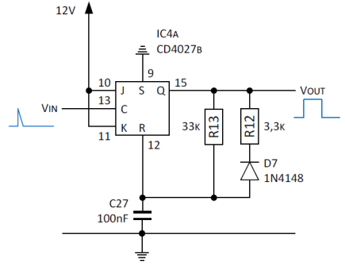
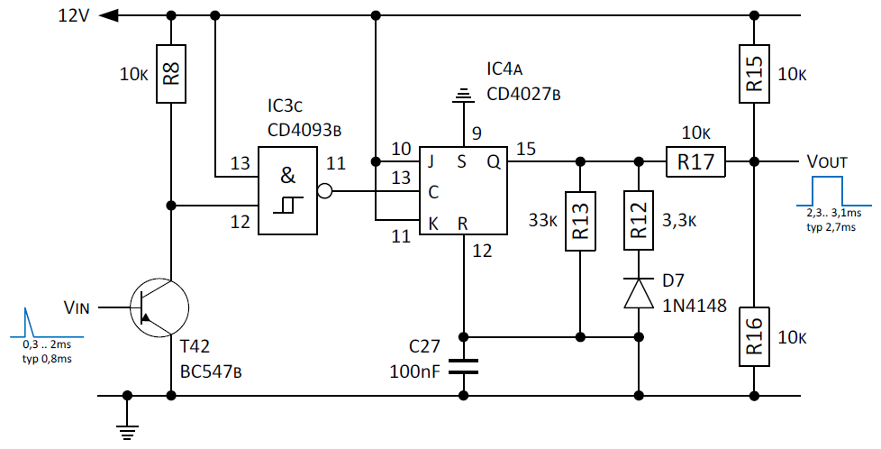
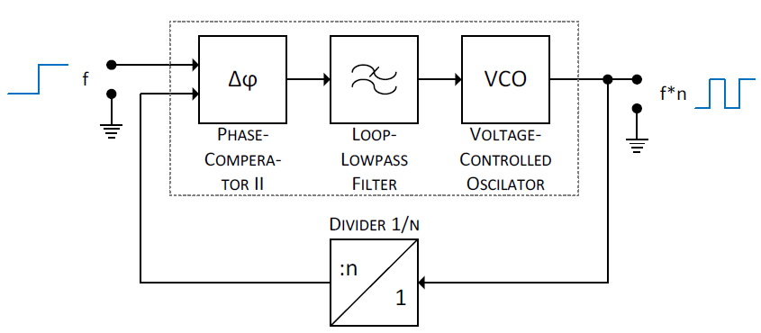
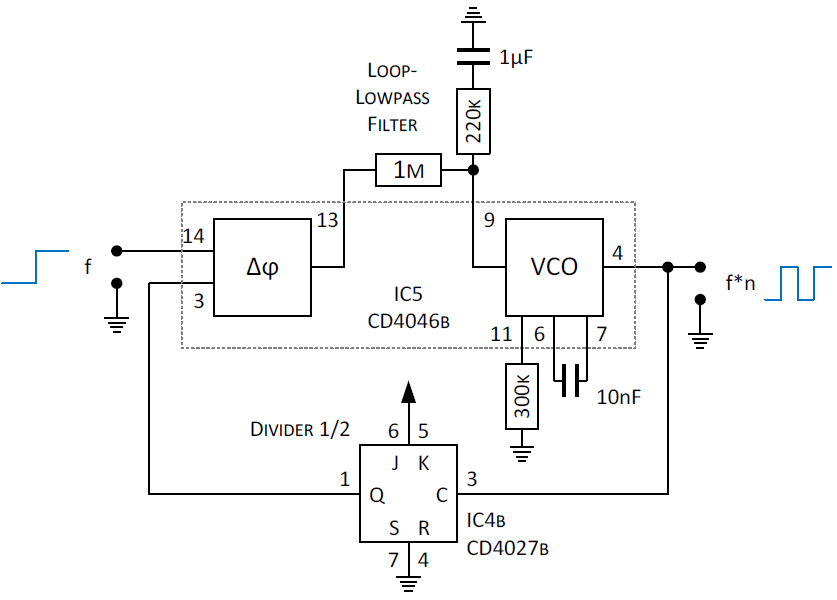
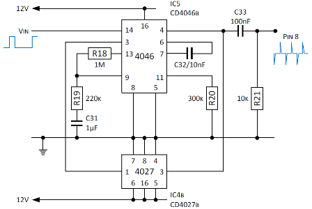

Die Anschaltung für das Herabsetzen der Zündimpulse wird 1:1 übernommen. Die Anschaltung erfolgt in Analogie an Eingang 3.1.

Die Aufbereitung der Zündimpulse soll nicht in diskreter Bauweise sondern mittels CMOS-IC erfolgen. Hierzu eignet sich ein getaktetes D-Flipflop (4013) oder JK-Flipflop (4027), welches als Monostabile Kippstufe genutzt wird. Der CMOS 4027 enthält zwei getrennte JK-Flipflops (Datenblatt: [cd4027b.pdf](http://www.ti.com/lit/ds/symlink/cd4027b.pdf)). Aufgrund einer späteren weiteren Verwendung des gleichen Bausteins für einen Binärzähler mit einem Teilerfaktor von Eins, wird dieser anstatt eines Timer-ICs 555 verwendet.

Die folgende Schaltung ist die Grundschaltung eines JK-Flipflops als nicht retriggerbare monostabile Kippstufe.

Die Bauteile R13 und C27 dienen als Eingangsbeschaltung für Pin 12 des Flip-Flops als Timer und sind für die Dauer des Ausgangsimpulses t1 verantwortlich. Um das „Klingeln“ zu unterdrücken muss t1 Werte größer 2ms haben. Bei maximaler Drehzahl (= 12000 rpm) sollte der Impulspauseverhältnis in etwa 1:1 betragen, d.h. der Wert von t1 darf maximal ca. 2,5ms (= 200Hz) betragen.

Die Berechnung der Impulsdauer erfolgt (auch hier) mit der Formel t1 = 0,7 * R13 * C27 mit einer Genauigkeit von ca. 20% (Aufgrund von Exemplarstreuung). Die Schaltung erholt sich rascherer, wenn C27 kleine Werte erhält. Daher wurde C27 mit 100nF und R13 mit 33k festgelegt (zum Vergleich, bei der Geberplatine hat C27 einen Wert von 220nF und R13 einen Wert von 15k).

    t1 = 0,7 * R13 * C27 = 0,7 * 33k * 100nF = 2,42ms

Trotz der genannten Ungenauigkeit wird (im Vergleich zur Geberplatine) kein Potentiometer R14 zum Trimmen eingesetzt, da eine Genauigkeit für die zukünftige, nachfolgende Signalverarbeitung nicht benötigt wird.

Wenn der Zyklus endet wird der Kondensator C27 mittels Diode D7 über R12 (und zum Teil auch über R13) entladen. Würde R12 gegen eine direkte Verbindung ersetzt, so ergibt sich zwar eine sehr kurze Erholzeit, was jedoch zu einer Verschlechterung der Form der Ausgangsspannung an Q (Pin 15) führen würde. Um eine scharfe rechteckige Spannung am Q-Ausgang zu erhalten, ist für R12 ein Wert von 3,3k oder höher zu wählen.

Die folgende Schaltung zeigt die Integration der Monostabilen Kippstufe in die Ersatzschaltung für die Geberplatine:

Der Triggerimpuls an C (Pin 13) wird zusätzlich über ein Inverter mit Schmittrigger geführt. Abgebildet wird dies über ein (bereits oben für die Kontrollanzeige verwendetes) Gatter vom CMOS 4093. Der Widerstand R8 dient hier im Gegensatz zur Geberplatine als Pullup-Widerstand, der den Eingang der Schaltung auf einen festen High-Pegel (Vcc) legt, solange der Transistor T42 sperrt. Ein ausreichend große Spannung (Ube ca. 0,7V) an der Basis von Transistor T42 schaltet diesen in den leitenden Zustand und liefert so den Triggerimpuls.

Eine Impuls-/Spannungswandlung wird für die nachgelagerte Schaltstufe nicht benötigt, stattdessen wird mittels Widerstandsnetzwerk R15-R17 ein definierter Pegel für Low bei 1/3 VCC und High bei 2/3 VCC festgelegt (Aufgrund des problembehafteten Linear-Verstärkerteils am Eingangs-Pin 14 vom 4046 – siehe nachgelagerte Schaltstufe). In der fertigen Schaltung wird zusätzlich noch ein Stützkondensator C7 von 100nF direkt am CMOS-IC zwischen Speisespannung und Masse eingesetzt.

## Frequenzdopplung
Bei einem 4-Takt-Motor sind zwei Umdrehungen für eine Zündung notwendig. D.h. da erst bei jeder zweiten Umdrehung ein Signal kommt, muss die Impulsfolge für das Kombiinstrument verdoppelt werden, um korrekte Werte anzuzeigen.

Die Frequenzverdopplung erfolgt auf Basis einer Phase-locked loop (PLL) Regelung. Zu einer PLL gehört zwar ein eigener steuerbarer Oszillator, doch wird dieser hier mittels Regelstruktur bezogen auf die Eingangsimpulsfrequenz eingestellt. Ein 2:1-Frequenzteiler in der Rückkopplungsschleife ermöglicht eine Verdopplung des Referenztaktes.

Zum vollständigen Verständnis wird auf folgende Quellen "Theorie und Anwendungen des Phaselocked Loops" von Roland Best (ISBN: 3-85502-132-5) und "Halbleiter-Schaltungs-Technik" von Tietze/Schenk verweisen.

"Das CMOS-Kochbuch" von Don Lancaster (ISBN: 3-88322-002-7) bietet praktikable Beispiele und Tipps und dient als Quelle für die Schaltungsentwurf. Die Umsetzung der Frequenzverdopplung erfolgt in CMOS 4000er-Familie mit einem PLL-Baustein CD4046B (Datenblatt: [cd4046b.pdf](http://www.ti.com/lit/ds/symlink/cd4046b.pdf)) und einem JK-Flipflop-Baustein CD4027B (Datenblatt: [cd4027b.pdf](http://www.ti.com/lit/ds/symlink/cd4027b.pdf)) als Frequenzteiler.

Die Impulsfolge wird auf den (ersten) Eingang vom Komperator 2 (Pin 14) des 4046 gelegt. Vorteil, sofern kein Signal am Eingang anliegt, wird die Minimal-Frequenz fmin am Ausgang ausgegeben. Die Minimal-Frequenz f(min) wird über den nicht eingesetzten Widerstand an Pin 12 (offen = unendlich) bestimmt und beträgt 0 Hz.

Der Komperator-Ausgang (Pin 13) wird über einen Schleifen-Filter (Loop-Lowpass-Filter), bestehend aus Widerstand R18, R19 und C31, mit dem VCO-Eingang vom Pin 9 verbunden.

Die Einstellzeit der Schleife wird durch R18 und C31 bestimmt. Eine zu große RC-Zeitkonstante macht die Schleife zu langsam um Änderungen der Eingangsfrequenz (Pin 14) folgen zu können. Eine zu kleine RC-Zeitkonstante würde ggf. nicht genügend Eingangszyklen für einen ruhigen VCO-Ausgang (Pin 4) ermitteln.

Die Dämpfung der Schleife wird durch das Verhältnis von R18 zu R19 bestimmt. Kleine Werte von R19 (oder null) bewirken ein Prellen, Überschwingungen oder Schwingungen der Schleife. Ein zu großer Wert macht die Schleife zu Träge, um sich auf eine neue Eingangsfrequenz einzustellen.

Die Dimensionierung von R18 (= 1MOhm), R19 (= 220k) und C31 (= 1μF) erfolgte experimentell (Startwerte R18 = 470k, R19 = 47k und C31 = 1μF). Die maximale Ausgabefrequenz fmax des spannungsgesteuerten Oszillators (ca. 200-300Hz) wird über dem Kondensator C32 zwischen Pin 6 und 7 und dem Widerstand R20 an Pin 11 und über die Minimal-Frequenz f(min) (= 0 Hz) bestimmt.

Die Werte für C32 (= 10nF / im Bild C1) und R20 (= 300k / im Bild R1) wurden aus folgender Darstellung ermittelt:

![Voltage-Controlled Oscillator [VCO] Using the 4046 (CB109)](../images/cb0109e_0001.gif)

Die Ausgangsspannung erscheint an Pin 4 und wird über einen Frequenzteiler zum zweiten Komparator-Eingang (Pin 3) geführt. Der Oszillator läuft nur, wenn Pin 5 auf Low liegt.

Der Baustein 4027 hat zwei JK-Flipflops. Flipflop 2 des ICs wird als Teiler verwendet, um den Eingang am PLL (Pin 3) anzusteuern. Hierzu werden die Eingänge J (Pin 6) und K (Pin 5) an High (= VCC) und Set (Pin 7) und Reset (Pin 4) an Low (= Masse) gelegt.

Nun arbeitet das Flipflop als Toggle-Flipflop. Jede positive Flanke am Clock (Pin 3) für zu einem Pegelwechsel am (positiven) Ausgang Q (Pin 1). Zur Frequenzteilung wird einfach das Signal an Clock gelegt und am Ausgang Q vom Flipflop abgegriffen.

Motorräder mit Transistor-, Elektronik- oder Kontaktzündung benötigten ein Drehzahlmesser mit positiven Eingangsimpuls. Leider beinhaltet das Kombiinstrument einen Drehzahlmesser der mit negativem Eingangsimpuls arbeitet, welcher für Motoräder mit CDI-Zündung entwickelt wurde. Da wir keine CDI-Zündung haben, muss eine Adaption für den negativen Eingangsimpuls her.

Hierzu dient ein einfaches RC-Glied bestehen aus dem Kondensator C33 (= 100nF) der am Ausgang des Frequenzverdopplers angeschlossen ist und Widerstand R21 (= 10k) gegen Masse. Das RC-Glied erzeugt aus dem Rechtecksignal bei steigender Flanke positive (+Vcc) und bei fallender Flanke negative Impulse (-Vcc) mit einer Impulslänge von ca. 1ms (t = R*C).

In der fertigen Schaltung wird zusätzlich noch ein Stützkondensator C8 von 100nF direkt am 4046 zwischen Speisespannung und Masse eingesetzt.

## Quellen und weiterführende Literatur

### Links
- Electrical Engineering and Computer Science; [Phase-Locked Loops](https://people.eecs.ku.edu/~callen58/501/PLL_Notes_(Proj3).pdf)
- Elektronik-Kompendium; [Das MonoFlipflop und eine praktische Anwendung](https://www.elektronik-kompendium.de/public/schaerer/monoff.htm)
- Elektronik-Kompendium; [PLL-Frequenzsynthese: Spezielles Problem mit dem CD4046B](http://www.elektronik-kompendium.de/public/schaerer/pll4046.htm)
- Elektronik-Kompendium; [Ein spannungsgesteuerter Oszillator (VCO) mit dem CD4046B](http://www.elektronik-kompendium.de/public/schaerer/vco.htm)
- Umnicom von uwe.mnich@t-online.de; [Spannungsgesteuerter Oszillator](https://web.archive.org/web/20170916025339/http://www.umnicom.de/Elektronik/Schaltungssammlung/Vco/Vco.html#8.2)
- Institute Newton C. Braga Ltd; [Voltage-Controlled Oscillator [VCO] Using the 4046 (CB109)
](http://www.incbtech.com/index.php/circuit-bench/58-converters/168-voltage-controlled-oscillator-vco-using-the-4046-cb109)

### Nächste Seite
Weiter geht's mit [KFZ-Versorgungsspannung](versorgungsspannung.html).
