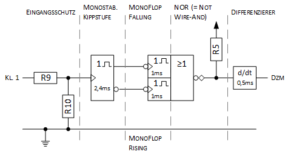
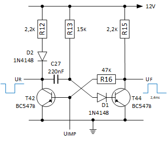
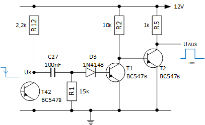
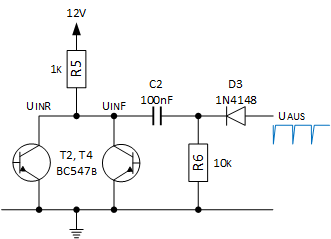

Eine Lösung in diskreter Form ist ebenfalls möglich. Gewünscht sind (negative) Impulse der doppelten Frequenz zum Eingangssignal. Um eine Impulsdopplung zu erzeugen, wird die als Impulsformer wirkende monostabile Kippstufe um zwei Zeitglieder erweitert. Die steigende und fallende Flanke der Monostabilen Kippstufe dienen als Steuerflanken, die auf zwei weitere Zeitglieder wirken. Jedes Zeitglied erzeugt aus der jeweiligen Flanke ein `high`-Signal von 1ms. Die Steuersignale werden anschließend NOR-verknüpft und mittes eines RC-Differenzierers werden die benötigten negative Impulse erzeugt. Folgend die schemtische Darstellung:

Laut Definition sind Kippschaltungen digitale Schaltung mit sprunghaftem Übertragungsverhalten, verursacht durch Rückkopplung. Eine Monostabile Kippstufe ohne Mittkoplungswiderstand ist vielleicht keine Kippstufe laut Definition, aber durchaus ein zeitgebendes Schaltungselement. Folgend als Monoflop bezeichnet.

### Kurzbeschreibung der Monostabilen Kippstufe

Eine ausführliche Beschreibung der Schaltung für die Geberplatine erfolgte bereits im [Teil 1](zuendsignalwandler_1.html). Zusammengefasst lässt sich die Schaltung wie folgt erklären:
1. Im Ruhezustand wird T44 über R13 und R14 in die Sättigung gezogen, damit hat Pin 8 annähernd 0V, T42 ist gesperrt und der zugehörige _Kollektorausgang_ von T42 hat Vcc.
2. Ein kurzer positiver Puls macht T42 leitend und es entsteht ein negativer Puls, der über C27 an die Basis von T44 weitergegeben wird.
3. T44 wird gesperrt und Pin 8 geht von 0 auf Vcc und über die Mitkopplung von R16 bleibt T42 im leitenden Zustand.
4. Der Kondensator C27 wird über R13+R14 entladen und nach der Zeit t = ln2*(R13+R14)*C27 wird T44 wieder leitend, Pin 8 geht gegen 0V und T42 sperrt.

Damit die Monostabilen Kippstufean auch an einer ungeregelte Spannung größer 5V betrieben werden kann, sind zwei zusätzlich Dioden einzubringen:
- Eine Diode vor die BE-Strecke von T44, welche verhindert, dass beim Entladevorgang von C27 keine gefährliche negative Spannung über der BE-Strecke von T42 abfällt (typischer Grenzwert für Bipolartransistoren ist max. −5 Volt).
- Eine Diode zwischen Kollektorwiderstand und Kollektor von T42 verhindert, dass bei einem sprunghaften Spannungseinbruch die Triggerfunktion für T44 nicht ausgelöst wird. 

Die nachgelagerten Schaltstufen für die Monoflops werden am jeweiligen Kollektorwiderstand der beiden Transistoren T42 und T44 angeschlossen. Der _Kollektorausgang_ von T44 (Pin 8) liefert den negativen Eingangsimpuls für das Monoflop R und der _Kollektorausgang_ von T42 den negativen Eingangsimpuls für das Monoflop F.

Da beide Monoflops rückkopplungsfrei arbeiten (was auch die Störsicherheit erhöht), muss die eingestellte Impuls- und Rückstellzeit vom Monoflop immer kürzer sein, als die erzeugte Impulszeit der vorgelagerten Monostabilen Kippstufe.

### Kurzbeschreibung Monoflop R

Transistor T44 und Widerstand R15 bilden zusammen mit dem Transistor Tr und den zeitsteuenden Elementen Cr und Rr das rückkopplungsfreie Monoflop R (steigende Flanke).

1. Wenn T44 in den leitenden Zustand wechselt wird eine fallende Flanke am Pin 8 erzeugt
2. Das negative Potential wird über Cr an die Basis von Ts weitergegeben.
3. Tr wird gesperrt und der Ausgang R geht von `low` auf `high`.
4. Der Kondensator Cr wird über Rr entladen und nach der Zeit t = ln2*Rr*Cr wird Tr wieder leitend und der Ausgang R geht wieder auf `low`.

Die Dauer, die der Kondensator Cr nach dem Flankenwechsel zum Entladen braucht, errechnet sich wie folgt:

    t1r = ln2 * Rr * Cr = 0,69 * 15k * 100nF = 1ms

Die Erholzeit hat den 3- bis 5-fachen Wert der Zeitkonstante `Cr*R15`:

    t2r = 5 * R15 * Cr = 5 * 2,2k * 100nF = 1,1ms

### Kurzbeschreibung Monoflop F
Transistor T42 und Widerstand R12 bilden zusammen mit dem Transistor Tf und den zeitsteuenden Elementen Cf und Rf das rückkopplungsfreie Monoflop F (fallende Flanke).

1. Im Ruhezustand ist T42 gesperrt und der zugehörige _Kollektorausgang_ hat annähernd Vcc.
2. Wenn T42 durch den Eingangsimpuls in den leitenden Zustand wechselt, wird am Kollektor ein negativer Puls erzeugt und über Cf an die Basis von Tf weitergegeben.
3. Tf wird gesperrt und der Ausgang F geht von `low` auf `high`.
4. Der Kondensator Cf wird über Rf entladen und nach der Zeit t = ln2*Rf*Cf wird Tf wieder leitend und der Ausgnag F geht wieder auf `low`.

Die Verweildauer t1f (und Erholszeit t2f = `5*Cf*R12`) soll gleich t1s sein. Rf und Cf haben daher die gleichen Werte wie Cs und Rs.

### Kurzbeschreibung NOR-Funktion

Die invertierten Signale der beiden Monoflop-Ausgänge werden mittels [Wired-AND-Logik](http://de.wikipedia.org/wiki/Wired-AND) zu einem [NOR](http://www.play-hookey.com/digital_experiments/dtl/dtl_nor2.html) verknüft.

1. Das Signal wird mittels einer direkt gekopppelten Transistorschaltstufe invertiert ([DCTL](http://en.wikipedia.org/wiki/Direct-coupled_transistor_logic)).
2. Die offenen Kollektoren der Ausgangs-Transistoren ([Open-Collector-Ausgang](http://de.wikipedia.org/wiki/Open-Collector-Ausgang)) erhalten einen gemeinsamen Kollektorwiderstand ([Pull-up Widerstand](http://de.wikipedia.org/wiki/Open_circuit#Pull-up)).

## Quellen und weiterführende Literatur

### Links
- WartburgPeter.de; [Drehzahlmesser (Aufbauinstrument mit A277D)](www.wartburgpeter.de/download/dzm.pdf)
- Wikipedia; [Monostabile Kippstufe](http://de.wikipedia.org/wiki/Monostabile_Kippstufe)
- Siemens; Halbleiter-Schaltbeispiele Ausgabe April 1970; [4.1 Taktgeber mit vielen Anwendungsmöglichkeiten](http://www.fingers-welt.de/info/siemens_schaltbeispiele_1970_1.pdf)
- Texas Instruments; Design and Application of Transistor Switching Circuits; [14 Pulse-generating and Pulse-shaping Networks](http://archive.org/details/DesignAndApplicationOfTransistorSwitchingCircuits/page/n279)
- Elektronik-Kompendium; [Vom passiven RC- zum passiven RCD-Hochpassfilter/Differenzierer](http://www.elektronik-kompendium.de/public/schaerer/rcdhp.htm)
- Elektroniktutor.de; [Impulsformung mittels RC-Hochpass](https://elektroniktutor.de/analogtechnik/differz.html)

### Nächste Seite
Weiter geht's mit [Zündsignalwandler mit CMOS](zuendsignalwandler_3.html).
